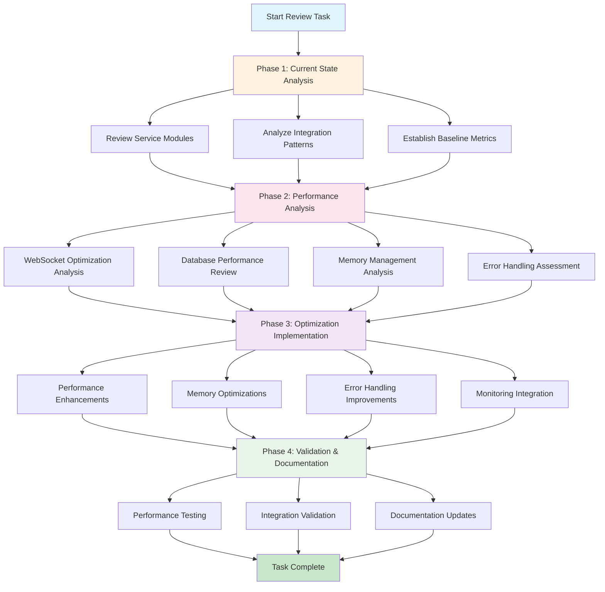

# Event-Pipeline Optimization Workflow

## Key Decision Points

- **Memory Optimization**: Focus on WebSocket connection management and object lifecycle
- **Performance**: Prioritize database query optimization and response time improvements
- **Reliability**: Enhance error handling and implement circuit breaker patterns
- **Monitoring**: Leverage existing shared library capabilities for observability

## Critical Path

1. **Baseline Establishment** → Performance Analysis → Optimization Implementation → Validation
2. **Parallel Tracks**: WebSocket optimization, Database performance, Memory management
3. **Integration Points**: Shared library usage, monitoring integration, error handling

## Success Metrics

- **Performance**: 20% response time improvement, 25% connection capacity increase
- **Reliability**: 95% error handling coverage, graceful degradation
- **Efficiency**: 15% memory usage reduction, optimized resource management
- **Observability**: Enhanced monitoring integration, comprehensive metrics
