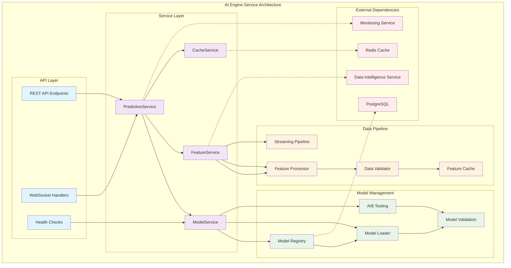
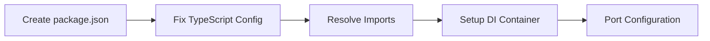
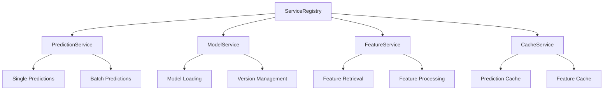
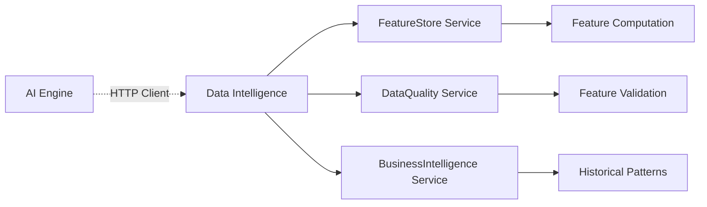
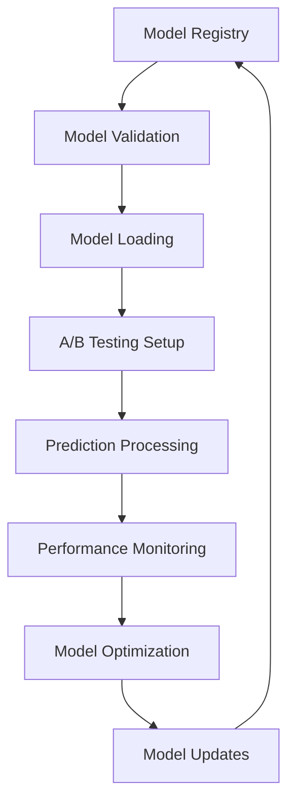
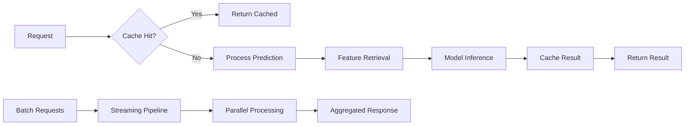
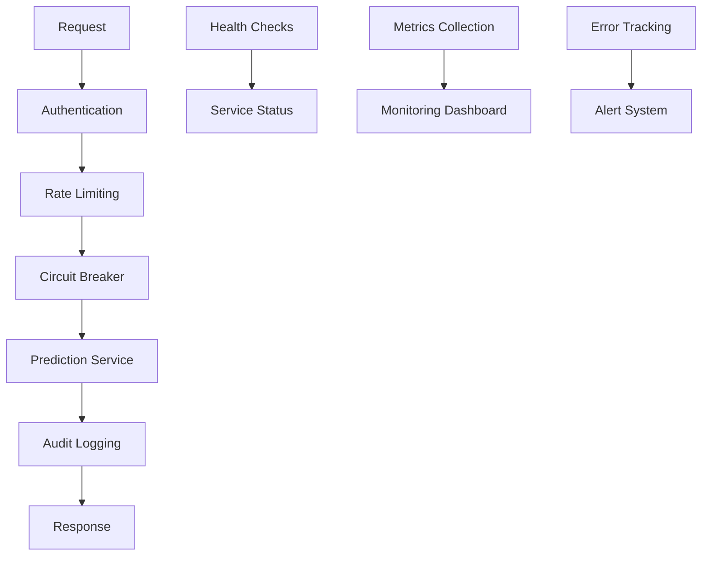

# AI Engine Service - Workflow Diagram

## Workflow Phases

### Phase 1: Foundation Setup

### Phase 2: Service Architecture

### Phase 3: Data Intelligence Integration

### Phase 4: ML Model Pipeline

### Phase 5: Performance Optimization

### Phase 6: Production Monitoring

## Data Flow Architecture

### Single Prediction Flow
1. **Request Validation** → Authentication & Rate Limiting
2. **Cache Check** → Redis lookup for existing prediction
3. **Feature Retrieval** → Data Intelligence Service integration
4. **Model Selection** → A/B testing and model routing
5. **Prediction** → ML model inference
6. **Result Caching** → Store for future requests
7. **Response** → Formatted prediction result

### Batch Prediction Flow
1. **Batch Validation** → Size limits and authentication
2. **Request Streaming** → Process in chunks
3. **Parallel Processing** → Multiple prediction workers
4. **Feature Batching** → Optimized data intelligence calls
5. **Model Distribution** → Load balancing across models
6. **Result Aggregation** → Combine partial results
7. **Streaming Response** → Real-time result delivery

### Model Management Flow
1. **Model Registration** → Version control and metadata
2. **Validation Pipeline** → Model testing and validation
3. **Deployment** → Hot-swap without downtime
4. **A/B Testing** → Traffic splitting and comparison
5. **Performance Monitoring** → Accuracy and latency tracking
6. **Optimization** → Model tuning and updates

## Integration Patterns

### Data Intelligence Service Integration
- **HTTP Client Pool** → Efficient connection management
- **Circuit Breaker** → Fault tolerance and graceful degradation
- **Retry Logic** → Automatic error recovery
- **Feature Caching** → Reduce service load
- **Health Monitoring** → Dependency health tracking

### Model Management Patterns
- **Registry Pattern** → Centralized model metadata
- **Strategy Pattern** → Pluggable model implementations
- **Observer Pattern** → Model performance monitoring
- **Factory Pattern** → Model instantiation and configuration
- **Singleton Pattern** → Model instance management

---

**This workflow diagram provides a visual representation of the AI Engine Service architecture and the implementation phases, helping guide development and ensure proper integration with existing infrastructure.**
