# Intervention Engine Service Workflow

```mermaid
graph TD
    A[Service Architecture Review] --> B[Create Task Structure]
    B --> C[Phase 1: Infrastructure Setup]

    C --> D[Create Service Directory]
    C --> E[Setup Package.json + Dependencies]
    C --> F[Configure @libs/elysia-server with WebSocket]

    F --> G[Phase 2: Core Delivery System]
    G --> H[WebSocket Gateway Implementation]
    G --> I[Delivery Services & Controllers]
    G --> J[Queue System Setup]

    J --> K[Phase 3: Notification Channels]
    K --> L[Email Service Integration]
    K --> M[SMS Service Integration]
    K --> N[Push Notification Service]
    K --> O[Template Management System]

    O --> P[Phase 4: Tracking & Analytics]
    P --> Q[Event Tracking Implementation]
    P --> R[Attribution & Analytics Services]
    P --> S[Data Storage Configuration]

    S --> T[Phase 5: Campaign Management]
    T --> U[Campaign CRUD Operations]
    T --> V[A/B Testing Framework]
    T --> W[Personalization Engine]

    W --> X[Phase 6: Integration & Testing]
    X --> Y[Service Integration Tests]
    X --> Z[Performance & Load Testing]
    X --> AA[End-to-End Validation]

    AA --> BB[Production Ready ✅]

    style A fill:#e1f5fe
    style BB fill:#c8e6c9
    style C fill:#fff3e0
    style G fill:#fff3e0
    style K fill:#fff3e0
    style P fill:#fff3e0
    style T fill:#fff3e0
    style X fill:#fff3e0
```

## Workflow Phases

### 🏗️ Phase 1: Infrastructure Setup

**Input**: Service Architecture Review, Existing Patterns
**Output**: Working Elysia server with WebSocket support
**Key Activities**:

- Leverage @libs/elysia-server (do NOT create from scratch)
- Follow existing service directory structure
- Enable WebSocket capabilities using built-in support

### ⚡ Phase 2: Core Delivery System

**Input**: WebSocket-enabled service foundation
**Output**: Real-time intervention delivery system
**Key Activities**:

- Implement WebSocket gateway with connection management
- Create delivery services following established patterns
- Set up Redis-based queue system

### 📱 Phase 3: Notification Channels

**Input**: Core delivery infrastructure
**Output**: Multi-channel notification system
**Key Activities**:

- Integrate external providers (email, SMS, push)
- Implement template management with personalization
- Configure channel selection and optimization

### 📊 Phase 4: Tracking & Analytics

**Input**: Notification delivery system
**Output**: Comprehensive tracking and analytics
**Key Activities**:

- Event tracking for all intervention touchpoints
- Attribution modeling for conversion analysis
- Performance analytics and monitoring integration

### 🎯 Phase 5: Campaign Management

**Input**: Tracking and delivery systems
**Output**: Campaign and A/B testing capabilities
**Key Activities**:

- Campaign CRUD operations with scheduling
- A/B testing framework with statistical analysis
- User segmentation and personalization engine

### ✅ Phase 6: Integration & Testing

**Input**: Complete intervention system
**Output**: Production-ready service
**Key Activities**:

- Integration testing with existing services
- Performance testing (WebSocket load, delivery latency)
- End-to-end validation of intervention flows

## Critical Success Factors

### ⚠️ CRITICAL - Do Not Reinvent

- **USE** @libs/elysia-server WebSocket capabilities
- **FOLLOW** existing service patterns (event-pipeline, ai-engine)
- **LEVERAGE** ServiceContainer dependency injection
- **VERIFY** before implementing - check existing code first

### 🎯 Key Integration Points

- **AI Engine**: Receives predictions for intervention triggering
- **Event Pipeline**: Consumes cart events for context
- **Data Intelligence**: Gets user profiles and preferences
- **API Gateway**: Authentication and rate limiting

### 📈 Performance Targets

- **WebSocket Connections**: 1000+ concurrent connections
- **Delivery Latency**: <100ms for real-time interventions
- **Throughput**: Process 500+ interventions/second
- **Reliability**: 99.9% delivery success rate

## Decision Points & Validation

### Architecture Verification

- [ ] Confirmed @libs/elysia-server WebSocket patterns
- [ ] Reviewed existing service structures for consistency
- [ ] Validated external provider integration approaches
- [ ] Checked monitoring and observability requirements

### Implementation Checkpoints

- [ ] Phase 1: WebSocket connection test successful
- [ ] Phase 2: Real-time delivery working end-to-end
- [ ] Phase 3: Multi-channel notifications functional
- [ ] Phase 4: Tracking data flowing correctly
- [ ] Phase 5: Campaign system operational
- [ ] Phase 6: Production deployment ready
