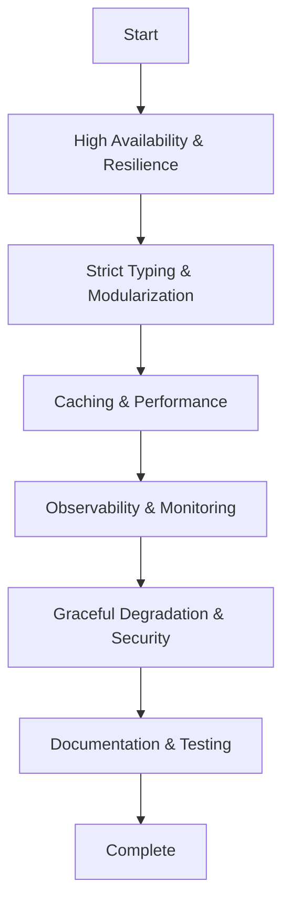

# Workflow Diagram: Data Intelligence Service Optimization

```mermaid
graph TD
    A[Start] --> B[High Availability & Resilience]
    B --> C[Strict Typing & Modularization]
    C --> D[Caching & Performance]
    D --> E[Observability & Monitoring]
    E --> F[Graceful Degradation & Security]
    F --> G[Documentation & Testing]
    G --> H[Complete]
```
