# AuthV2 Security Critical Fixes - Workflow Diagram


## Task Flow Architecture

```mermaid
flowchart TD
    Start([Task Start: AuthV2 Security Fixes]) --> AuditAnalysis[Analyze Both Audit Reports]

    AuditAnalysis --> Phase1{Phase 1: Critical Security}

    Phase1 --> P1_1[1.1 Password Hashing<br/>🔥 CRITICAL<br/>Replace plaintext comparison]
    Phase1 --> P1_2[1.2 Input Validation<br/>🔥 HIGH<br/>Zod schemas & sanitization]
    Phase1 --> P1_3[1.3 Session Security<br/>🔥 HIGH<br/>Encryption & secure IDs]
    Phase1 --> P1_4[1.4 Type Safety<br/>🔥 CRITICAL<br/>Fix 'any' types]

    P1_1 --> SecurityValidation{Security<br/>Validation}
    P1_2 --> SecurityValidation
    P1_3 --> SecurityValidation
    P1_4 --> SecurityValidation

    SecurityValidation -->|Pass| Phase2{Phase 2: Architecture}
    SecurityValidation -->|Fail| P1_1

    Phase2 --> P2_1[2.1 Service Refactoring<br/>📐 Split large services<br/>SRP compliance]
    Phase2 --> P2_2[2.2 Database Integration<br/>🗄️ Prisma & transactions<br/>Connection pooling]
    Phase2 --> P2_3[2.3 Redis Caching<br/>⚡ Distributed caching<br/>Replace in-memory]
    Phase2 --> P2_4[2.4 Rate Limiting<br/>🛡️ Distributed protection<br/>Advanced features]

    P2_1 --> ArchValidation{Architecture<br/>Validation}
    P2_2 --> ArchValidation
    P2_3 --> ArchValidation
    P2_4 --> ArchValidation

    ArchValidation -->|Pass| Phase3{Phase 3: Enterprise}
    ArchValidation -->|Fail| P2_1

    Phase3 --> P3_1[3.1 Audit & Monitoring<br/>📊 PostgreSQL audit logs<br/>Usage analytics]
    Phase3 --> P3_2[3.2 JWT Security<br/>🔐 jose library<br/>Key rotation]
    Phase3 --> P3_3[3.3 Performance<br/>⚡ Optimization<br/>Async operations]
    Phase3 --> P3_4[3.4 Testing<br/>🧪 >90% coverage<br/>Integration tests]

    P3_1 --> FinalValidation{Production<br/>Readiness}
    P3_2 --> FinalValidation
    P3_3 --> FinalValidation
    P3_4 --> FinalValidation

    FinalValidation -->|Pass| ProductionReady([Production Ready<br/>✅ All vulnerabilities fixed<br/>✅ Enterprise features complete])
    FinalValidation -->|Fail| P3_1

    %% Risk Mitigation Paths
    P1_1 -.->|Risk| RollbackP1[Phase 1 Rollback]
    P2_1 -.->|Risk| RollbackP2[Phase 2 Rollback]
    P3_1 -.->|Risk| RollbackP3[Phase 3 Rollback]

    RollbackP1 --> P1_1
    RollbackP2 --> P2_1
    RollbackP3 --> P3_1

    %% Parallel Testing Streams
    P1_1 --> SecurityTests[Security<br/>Penetration Tests]
    P2_3 --> PerformanceTests[Performance<br/>Benchmarks]
    P3_4 --> IntegrationTests[Integration<br/>Test Suite]

    SecurityTests --> SecurityValidation
    PerformanceTests --> ArchValidation
    IntegrationTests --> FinalValidation

    classDef critical fill:#ff9999,stroke:#ff0000,stroke-width:3px
    classDef high fill:#ffcc99,stroke:#ff6600,stroke-width:2px
    classDef medium fill:#99ccff,stroke:#0066cc,stroke-width:2px
    classDef success fill:#99ff99,stroke:#00cc00,stroke-width:3px

    class P1_1,P1_4 critical
    class P1_2,P1_3,P2_1,P2_2 high
    class P2_3,P2_4,P3_1,P3_2,P3_3,P3_4 medium
    class ProductionReady success
```



## Decision Matrix Based on Both Audit Reports

```mermaid
quadrantChart
    title AuthV2 Issues: Impact vs Implementation Effort
    x-axis Low Effort --> High Effort
    y-axis Low Impact --> High Impact

    quadrant-1 Quick Wins (Do First)
    quadrant-2 Strategic Projects
    quadrant-3 Fill-ins (Do Last)
    quadrant-4 Major Projects (Plan Carefully)

    Plaintext Password Fix: [0.2, 0.95]
    Type Safety (any types): [0.3, 0.85]
    Input Validation: [0.4, 0.9]
    Session Security: [0.5, 0.8]
    Redis Caching: [0.7, 0.75]
    Service Refactoring: [0.8, 0.7]
    Test Suite: [0.6, 0.65]
    JWT Library: [0.4, 0.6]
    Audit Logging: [0.6, 0.55]
    Performance Optimization: [0.7, 0.5]
```

## Risk Assessment Matrix

| Risk Category               | Probability | Impact   | Severity        | Mitigation Strategy                           |
| --------------------------- | ----------- | -------- | --------------- | --------------------------------------------- |
| **Security Breach**         | HIGH        | CRITICAL | 🔴 **CRITICAL** | Immediate password hashing implementation     |
| **Performance Degradation** | MEDIUM      | HIGH     | 🟡 **MEDIUM**   | Comprehensive benchmarking during refactoring |
| **Service Interruption**    | LOW         | HIGH     | 🟡 **MEDIUM**   | Gradual rollout with feature flags            |
| **Integration Failures**    | MEDIUM      | MEDIUM   | 🟡 **MEDIUM**   | Extensive integration testing                 |
| **Redis Dependency Issues** | LOW         | MEDIUM   | 🟢 **LOW**      | Circuit breaker patterns and fallbacks        |

## Success Validation Flow

```mermaid
flowchart LR
    subgraph "Phase 1 Validation"
        S1[Security Audit] --> S2[Penetration Tests]
        S2 --> S3[Type Safety Check]
        S3 --> S4[Input Validation Tests]
    end

    subgraph "Phase 2 Validation"
        A1[Performance Benchmarks] --> A2[Redis Health Check]
        A2 --> A3[Service SRP Compliance]
        A3 --> A4[Transaction Testing]
    end

    subgraph "Phase 3 Validation"
        E1[Test Coverage Report] --> E2[Audit Log Verification]
        E2 --> E3[JWT Security Audit]
        E3 --> E4[Production Readiness]
    end

    S4 --> A1
    A4 --> E1
    E4 --> Production[🚀 Production Deployment]

    classDef validation fill:#e6f3ff,stroke:#0066cc
    classDef production fill:#e6ffe6,stroke:#00cc00,stroke-width:3px

    class S1,S2,S3,S4,A1,A2,A3,A4,E1,E2,E3,E4 validation
    class Production production
```



## Dependencies and Integration Points


## Implementation Timeline Overview

**Week 1 (Aug 21-25): Critical Security Fixes** 🔥

- Days 1-2: Password hashing implementation (Argon2)
- Days 3-4: Input validation framework (Zod schemas)
- Day 5: Session security hardening & type safety fixes

**Week 2 (Aug 26-30): Architecture Enhancement** 🏗️

- Days 1-2: Service refactoring (split AuthenticationService)
- Days 3-4: Redis distributed caching implementation
- Day 5: Database integration & transaction support

**Week 3 (Sep 2-6): Enterprise & Testing** 🚀

- Days 1-2: Audit logging & monitoring enhancement
- Days 3-4: JWT security library & performance optimization
- Day 5: Testing suite & production readiness validation

**Success Criteria:**

- ✅ Zero critical security vulnerabilities
- ✅ Authentication response time <200ms (p95)
- ✅ Test coverage >90% for critical paths
- ✅ Production monitoring operational

---

**Priority:** 🔥 **CRITICAL**  
**Timeline:** 3 weeks (120 hours)  
**Risk Level:** HIGH → LOW-MEDIUM (after completion)  
**Next Action:** Begin Phase 1.1 - Replace plaintext password comparison
