# AuthV2 Enterprise Optimization Workflow

## Critical Path Analysis

### High Priority (Blocking)

1. **Service Integration** (Phase 1) - Foundation for all other work
2. **Session Management** (Phase 2) - Security-critical functionality
3. **Testing & Observability** (Phase 5) - Production readiness

### Medium Priority (Important)

4. **Permission Storage** (Phase 3) - Performance and scalability
5. **Enhanced Models** (Phase 4) - Architecture consistency

## Phase Dependencies

## Risk Mitigation Flow

## Quality Gates

```mermaid
graph TD
    QG1[Code Review] --> QG2[Unit Tests Pass]
    QG2 --> QG3[Integration Tests Pass]
    QG3 --> QG4[Performance Benchmarks]
    QG4 --> QG5[Security Review]
    QG5 --> QG6[Production Deployment]

    QG6 --> Monitor[Monitoring Active]
    Monitor --> Success[✅ Phase Complete]
```

## Implementation Strategy

### Week 1: Foundation (Phase 1)

- Replace mock implementations
- Integrate with real services
- Establish error handling patterns

### Week 2: Security & Sessions (Phase 2)

- Implement robust session management
- Add security enhancements
- Complete audit logging

### Week 3: Storage & Performance (Phase 3)

- Database integration
- Redis caching implementation
- Performance optimization

### Week 4: Architecture & Models (Phase 4)

- Enhanced model integration
- Multi-tenancy implementation
- Runtime validation

### Week 5: Production Readiness (Phase 5)

- Comprehensive testing
- Performance profiling
- Observability integration
- Documentation completion

## Success Metrics

- **Code Quality**: >90% test coverage, zero critical vulnerabilities
- **Performance**: <100ms authentication response time, <50ms permission check
- **Reliability**: 99.9% uptime, <1% error rate
- **Security**: Pass security audit, implement all OWASP recommendations
- **Maintainability**: Full documentation, clear error messages, monitoring coverage
