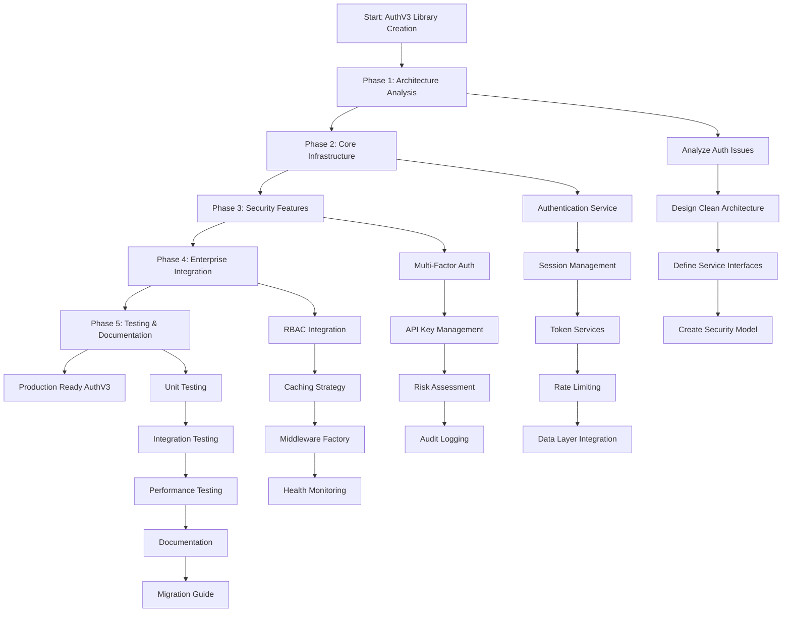
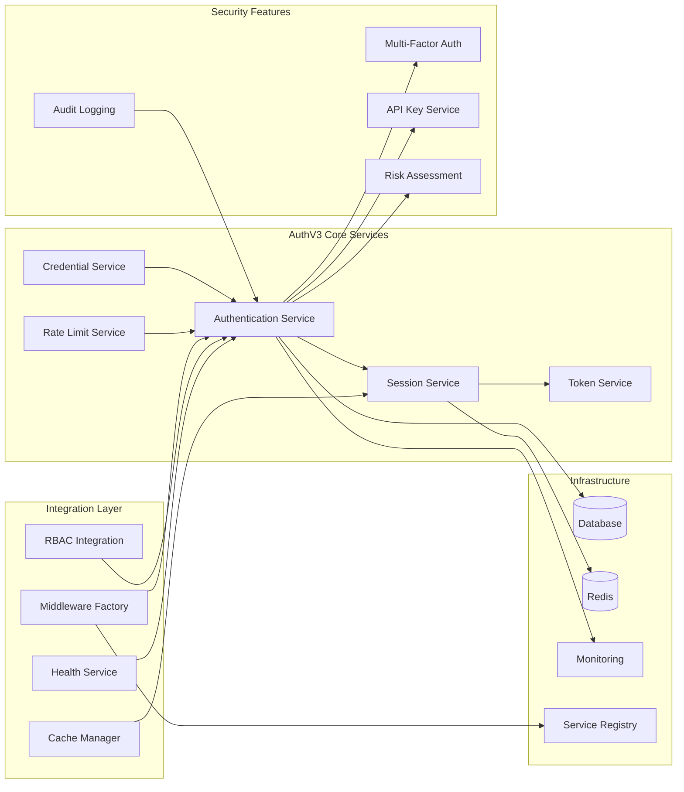
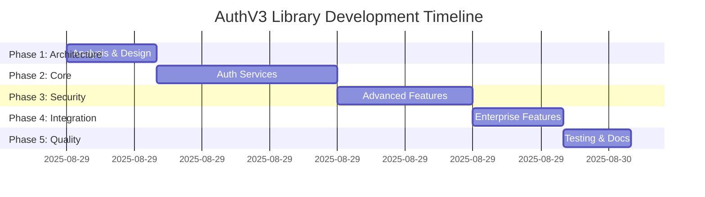
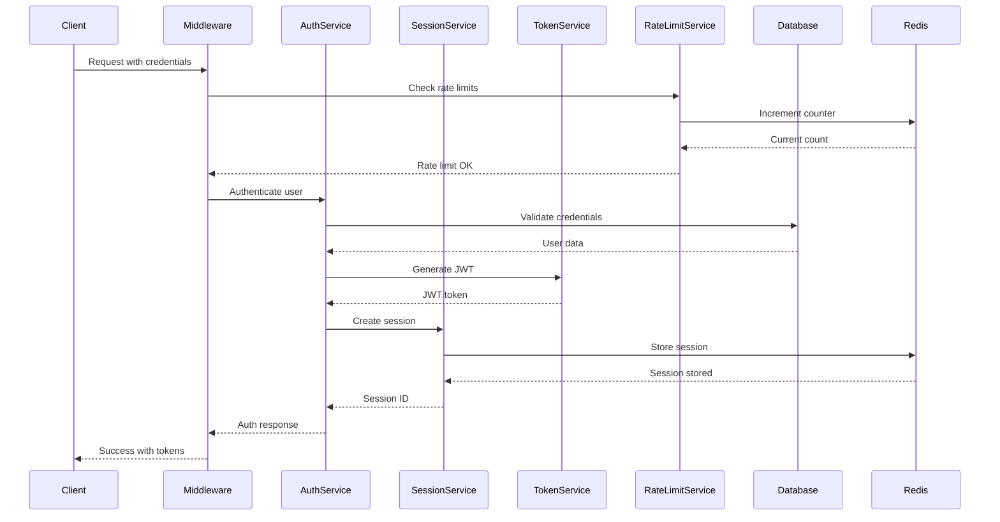
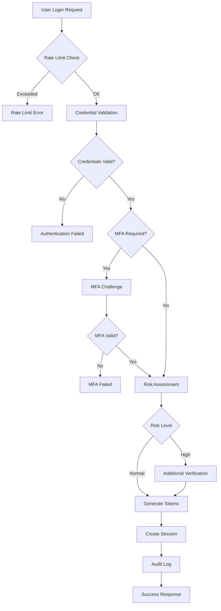
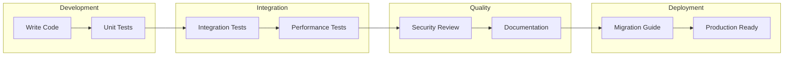

# AuthV3 Library Workflow Diagram

## 🔄 High-Level Development Workflow

## 🏗️ Architecture Flow

## 📊 Implementation Timeline

## 🔍 Service Interaction Flow

## 🛡️ Security Implementation Flow

## 🔧 Testing & Quality Workflow

---

## 📋 Implementation Checkpoints

### Phase Completion Criteria

- **Phase 1**: ✅ Architecture documented, interfaces defined, security model created
- **Phase 2**: ✅ Core services implemented, data layer integrated, basic auth flow working
- **Phase 3**: ✅ MFA working, API keys functional, risk assessment active
- **Phase 4**: ✅ All integrations complete, middleware factory functional, health checks active
- **Phase 5**: ✅ Tests passing, documentation complete, migration guide ready

### Quality Gates

- 🔒 **Security**: All crypto using battle-tested libraries
- ⚡ **Performance**: Authentication < 100ms, session lookup < 10ms
- 🧪 **Testing**: >90% coverage, integration tests passing
- 📚 **Documentation**: API docs complete, migration guide tested
- 🔄 **Integration**: ServiceRegistry DI working, RBAC connected
