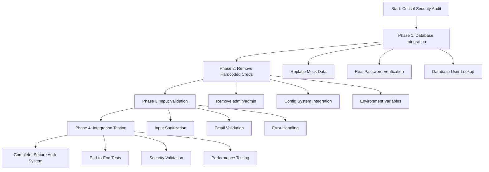
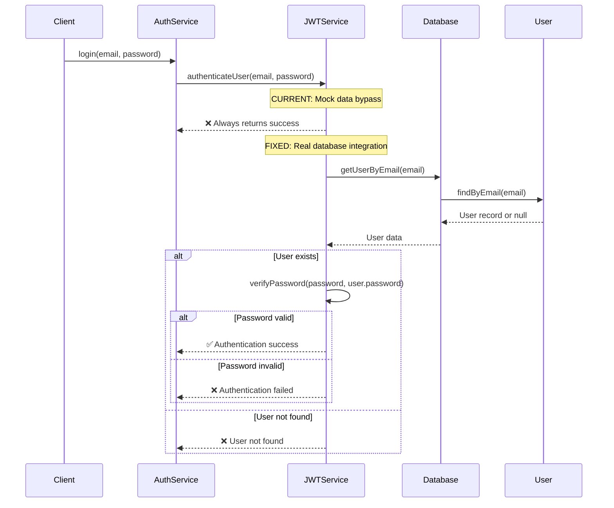
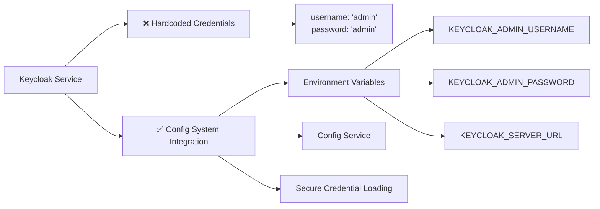
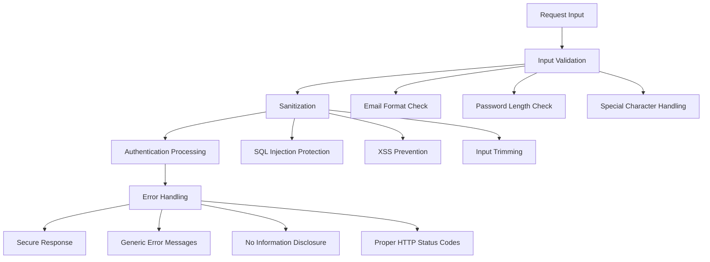
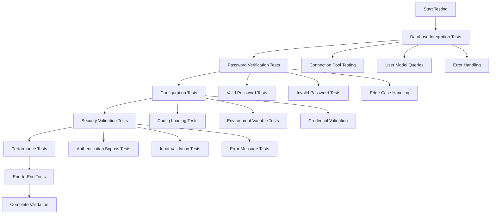
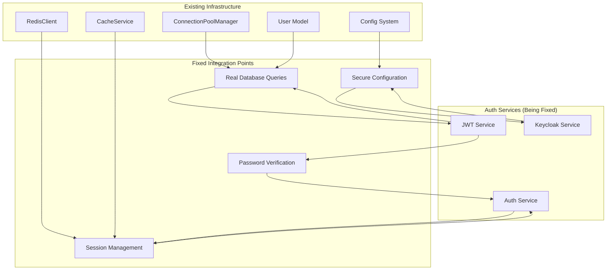
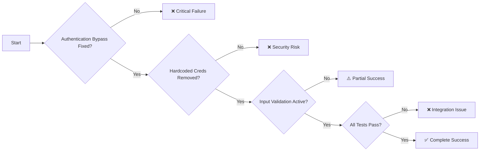

# Critical Auth Security Fix - Workflow Diagram

## 🔄 High-Level Process Flow



## 🏗️ Detailed Implementation Flow

### Phase 1: Database Integration & Authentication Fix



### Phase 2: Configuration Security Fix



### Phase 3: Security Hardening Flow



### Phase 4: Integration Testing Flow



## 🔧 Infrastructure Integration Diagram



## 📊 Progress Visualization

```mermaid
gantt
    title Critical Auth Security Fix Timeline
    dateFormat  YYYY-MM-DD
    section Phase 1
    Database Integration     :critical, p1, 2025-09-02, 8h
    Password Verification    :critical, p1a, after p1, 4h
    section Phase 2
    Remove Hardcoded Creds   :critical, p2, after p1a, 4h
    Config Integration       :p2a, after p2, 4h
    section Phase 3
    Input Validation         :p3, after p2a, 6h
    Security Hardening       :p3a, after p3, 2h
    section Phase 4
    Integration Testing      :p4, after p3a, 4h
    Security Validation      :p4a, after p4, 2h
```

## 🎯 Success Criteria Flow



---

**Key**:

- 🔴 Critical Priority (Phases 1-2)
- 🟡 High Priority (Phases 3-4)
- ✅ Success State
- ❌ Failure State
- ⚠️ Partial Success
