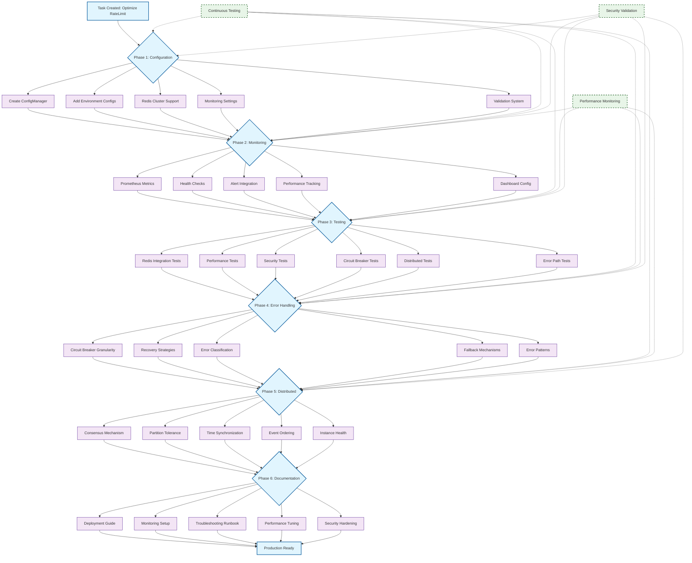
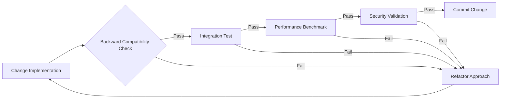

# RateLimit Optimization Workflow

## Workflow Description

### Phase Flow Strategy

Each phase builds upon the previous one while maintaining parallel validation streams:

1. **Configuration Foundation** → Set up production-ready configs
2. **Monitoring Infrastructure** → Add observability before optimization
3. **Quality Assurance** → Comprehensive testing before changes
4. **Resilience Enhancement** → Improve error handling and recovery
5. **Distributed Coordination** → Scale to multi-instance deployments
6. **Production Enablement** → Documentation and deployment readiness

### Parallel Validation Streams

**Continuous Testing Stream**:

- Unit tests run after each change
- Integration tests validate system behavior
- Regression tests prevent quality degradation

**Performance Monitoring Stream**:

- Benchmark before/after each phase
- Latency and throughput validation
- Memory and resource usage tracking

**Security Validation Stream**:

- Security tests after each configuration change
- Vulnerability scanning on new features
- Access control validation

### Critical Path Analysis

**Longest Path**: Configuration → Monitoring → Testing → Distributed → Documentation (22h)
**Critical Dependencies**:

- Phase 1 config changes enable Phase 2 monitoring
- Phase 2 monitoring enables Phase 3 performance testing
- Phase 3 tests validate Phase 4 error handling changes

### Risk Mitigation Flow

### Incremental Delivery Strategy

**Daily Deliverables**:

- **Day 1**: Configuration Management + Monitoring (Phases 1-2)
- **Day 2**: Comprehensive Testing Suite (Phase 3)
- **Day 3**: Error Handling + Distributed Improvements (Phases 4-5)
- **Day 4**: Documentation + Production Readiness (Phase 6)

**Rollback Points**: Each phase completion serves as a stable rollback point with working functionality.

---

_This workflow ensures systematic progression while maintaining production stability and comprehensive validation at each step._
