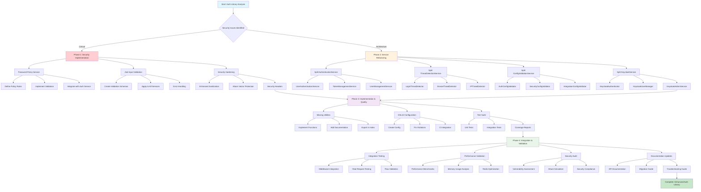
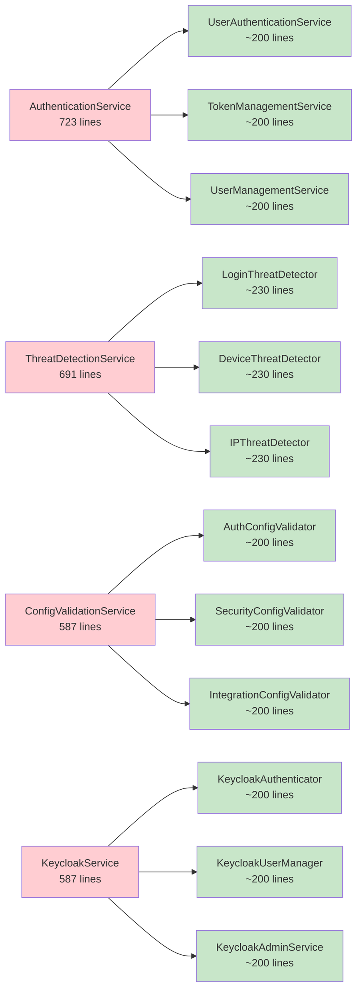
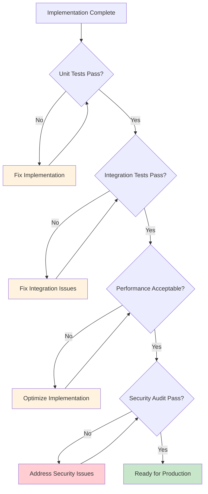

# Authentication Library Improvements Workflow

## Visual Workflow Representation



## Critical Path Analysis

### High Priority (Critical Security)

```
Password Policy → Input Validation → Security Hardening
```

**Timeline: Day 1**
**Dependencies: None**
**Impact: Eliminates critical security vulnerabilities**

### Medium Priority (Architecture)

```
Service Refactoring → API Compatibility → Integration Testing
```

**Timeline: Days 2-3**
**Dependencies: Phase 1 completion**
**Impact: Improves maintainability and code quality**

### Low Priority (Quality)

```
Missing Utilities → ESLint → Test Suite → Documentation
```

**Timeline: Days 4-5**
**Dependencies: Phase 2 completion**
**Impact: Enhanced developer experience and reliability**

## Service Refactoring Flow



## Validation & Testing Flow



## Risk Mitigation Strategy

### Backward Compatibility Protection

1. **API Contract Preservation**: All public interfaces remain unchanged
2. **Gradual Migration**: Services are replaced incrementally
3. **Feature Flags**: New validations can be disabled if needed
4. **Rollback Plan**: Original services backed up before refactoring

### Performance Impact Monitoring

1. **Benchmark Before/After**: Authentication flow timing
2. **Memory Usage Tracking**: Service footprint analysis
3. **Redis Performance**: Connection and query optimization
4. **Load Testing**: High-traffic scenario validation

### Security Validation Process

1. **Code Review**: Security-focused review of all changes
2. **Penetration Testing**: Simulated attack scenarios
3. **Compliance Check**: Ensure regulatory requirements met
4. **Vulnerability Scanning**: Automated security analysis

---

**This workflow ensures systematic, risk-controlled enhancement of the authentication library while maintaining enterprise-grade reliability and security.**
