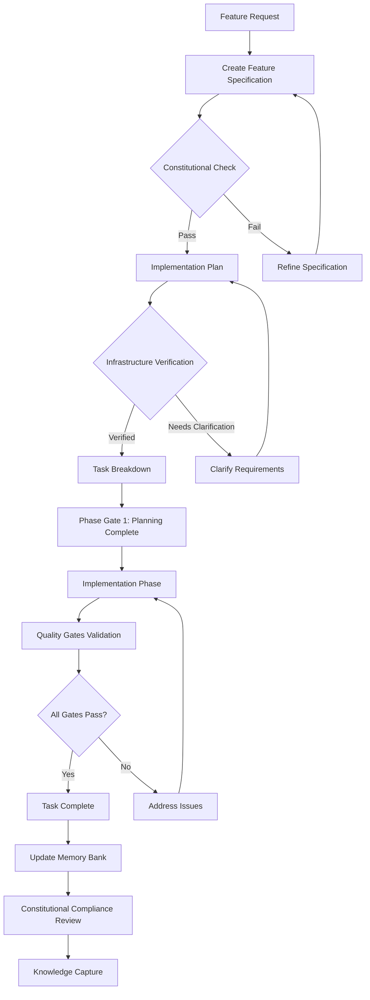
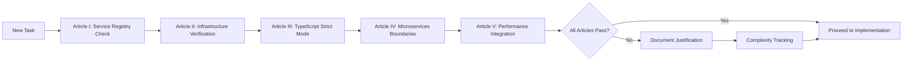
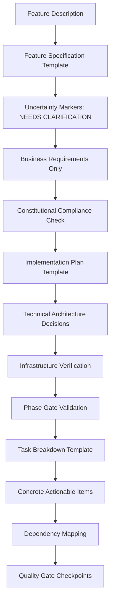
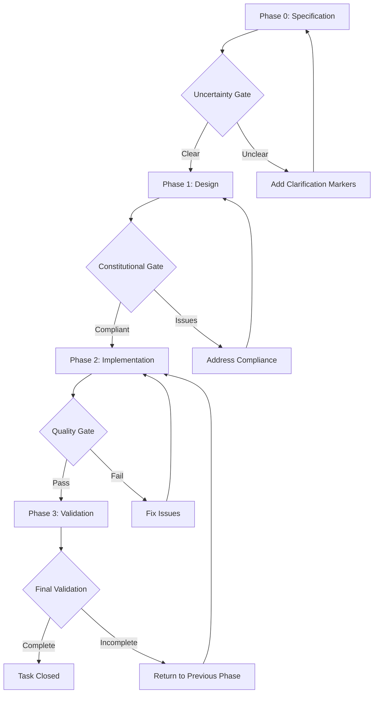
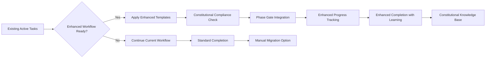
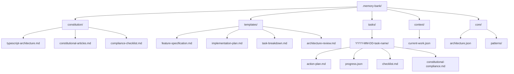
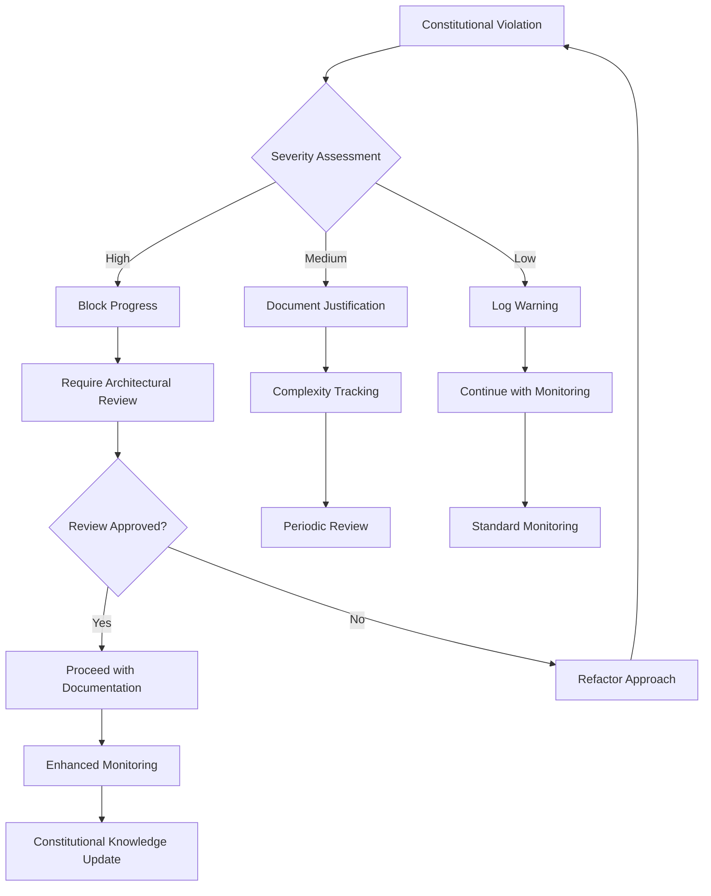

# Workflow Diagram: Spec Kit Memory Bank Enhancement

## Enhanced Memory Bank Workflow (Spec Kit Integration)



## Constitutional Framework Flow



## Template Enhancement Structure



## Phase Gate Progression



## Current vs Enhanced Workflow Comparison

### Current Workflow

```
Task Creation → Basic Template → Implementation → Completion
     ↓              ↓              ↓            ↓
  Date-based     Simple         Direct       Progress %
  Directory      Checklist      Coding       Tracking
```

### Enhanced Workflow (Spec Kit Integration)

```
Feature Request → Constitutional → Implementation → Quality → Knowledge
Specification     Compliance       Plan          Gates    Capture
     ↓                ↓              ↓            ↓         ↓
Business Focus   Architecture    Technical    Validation  Learning
& Uncertainty    Governance      Design       Gates       Storage
```

## Integration with Existing Tasks



## Memory Bank System Architecture



## Error Handling & Recovery Flow



---

**Key Enhancement Areas:**

1. **Constitutional Governance** - Architectural principles enforcement
2. **Template-Driven Quality** - Structured constraints for better outcomes
3. **Phase Gate Validation** - Quality checkpoints throughout workflow
4. **Uncertainty Management** - Explicit clarification requirements
5. **Infrastructure Verification** - Mandatory existing system leverage
6. **Knowledge Capture** - Constitutional compliance learning
