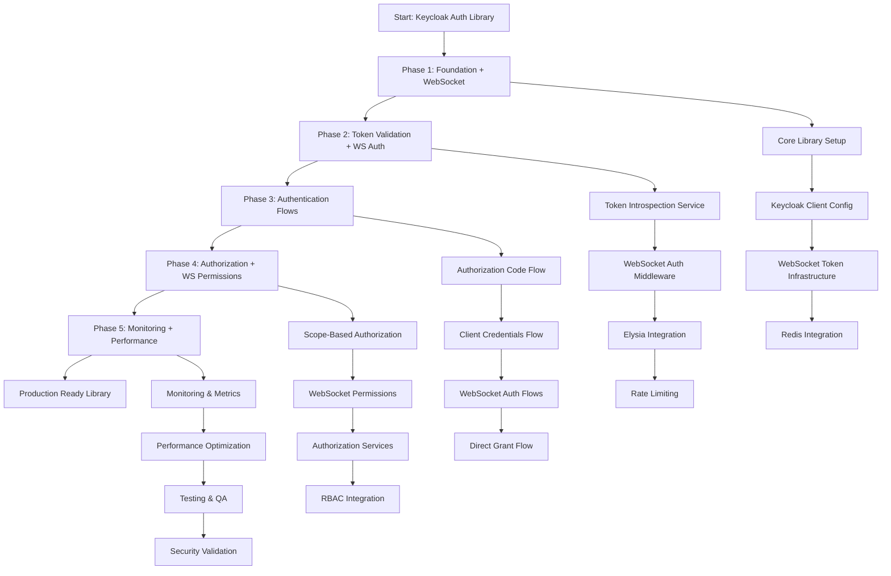

# Keycloak Authentication Library - Workflow Diagram

## High-Level Implementation Flow



## Detailed Technical Workflow

### Phase 1: Foundation Architecture

```
┌─────────────────┐    ┌─────────────────┐    ┌─────────────────┐
│   Package.json  │───▶│  TypeScript     │───▶│   Keycloak      │
│   Dependencies  │    │  Configuration  │    │   Client        │
└─────────────────┘    └─────────────────┘    └─────────────────┘
         │                       │                       │
         ▼                       ▼                       ▼
┌─────────────────┐    ┌─────────────────┐    ┌─────────────────┐
│   Jest Setup    │    │   Barrel        │    │   WebSocket     │
│   & Testing     │    │   Exports       │    │   Token Infra   │
└─────────────────┘    └─────────────────┘    └─────────────────┘
```

### Phase 2: Middleware Integration

```
┌─────────────────┐    ┌─────────────────┐    ┌─────────────────┐
│   Token         │───▶│   WebSocket     │───▶│   Elysia        │
│   Introspection │    │   Auth          │    │   Middleware    │
│   Service       │    │   Middleware    │    │   Chain         │
└─────────────────┘    └─────────────────┘    └─────────────────┘
         │                       │                       │
         ▼                       ▼                       ▼
┌─────────────────┐    ┌─────────────────┐    ┌─────────────────┐
│   Redis         │    │   Session       │    │   Rate          │
│   Caching       │    │   Management    │    │   Limiting      │
└─────────────────┘    └─────────────────┘    └─────────────────┘
```

### Phase 3: Authentication Flow Architecture

```
Frontend (SPA)           Services              TrackerJS           WebSocket
      │                      │                     │                   │
      ▼                      ▼                     ▼                   ▼
┌─────────────┐    ┌─────────────┐    ┌─────────────┐    ┌─────────────┐
│Authorization│    │   Client    │    │   Direct    │    │   WebSocket │
│    Code     │    │Credentials  │    │   Grant     │    │    Auth     │
│    Flow     │    │    Flow     │    │    Flow     │    │    Flows    │
└─────────────┘    └─────────────┘    └─────────────┘    └─────────────┘
      │                      │                     │                   │
      └──────────────────────┼─────────────────────┼───────────────────┘
                             ▼                     ▼
                   ┌─────────────────────────────────────┐
                   │         Keycloak Server             │
                   │      Token Validation &             │
                   │      Authorization                  │
                   └─────────────────────────────────────┘
```

### Phase 4: Authorization & Permissions

```
┌─────────────────┐    ┌─────────────────┐    ┌─────────────────┐
│   Scope-Based   │───▶│   WebSocket     │───▶│  Authorization  │
│  Authorization  │    │   Channel       │    │   Services      │
│                 │    │  Permissions    │    │  Integration    │
└─────────────────┘    └─────────────────┘    └─────────────────┘
         │                       │                       │
         ▼                       ▼                       ▼
┌─────────────────┐    ┌─────────────────┐    ┌─────────────────┐
│      RBAC       │    │   Fine-Grained  │    │   Policy-Based  │
│  Integration    │    │   Permissions   │    │   Access        │
│                 │    │                 │    │   Control       │
└─────────────────┘    └─────────────────┘    └─────────────────┘
```

### Phase 5: Monitoring & Performance

```
┌─────────────────┐    ┌─────────────────┐    ┌─────────────────┐
│  Authentication │───▶│   WebSocket     │───▶│  @libs/monitoring│
│    Metrics      │    │   Connection    │    │   Integration   │
│                 │    │    Metrics      │    │                 │
└─────────────────┘    └─────────────────┘    └─────────────────┘
         │                       │                       │
         ▼                       ▼                       ▼
┌─────────────────┐    ┌─────────────────┐    ┌─────────────────┐
│  Performance    │    │   Security      │    │   Test Suite    │
│  Optimization   │    │   Monitoring    │    │   90%+ Coverage │
│                 │    │   & Alerting    │    │                 │
└─────────────────┘    └─────────────────┘    └─────────────────┘
```

## WebSocket Authentication Flow Detail

```
Connection Request
        │
        ▼
┌─────────────────┐
│  Extract Token  │
│  from Headers/  │
│  Query Params   │
└─────────────────┘
        │
        ▼
┌─────────────────┐     ╔══════════════════╗     ┌─────────────────┐
│   Validate      │────▶║   Redis Cache    ║────▶│   Connection    │
│   Token with    │     ║   Check          ║     │   Established   │
│   Keycloak      │     ╚══════════════════╝     └─────────────────┘
└─────────────────┘              │                        │
        │                        ▼                        ▼
        ▼              ┌─────────────────┐     ┌─────────────────┐
┌─────────────────┐    │   Cache Miss    │     │   Message-Level │
│   Invalid       │    │   Validate      │     │   Auth (if      │
│   Disconnect    │    │   with          │     │   required)     │
│                 │    │   Keycloak      │     │                 │
└─────────────────┘    └─────────────────┘     └─────────────────┘
```

## Integration Points with Existing System

```
┌─────────────────────────────────────────────────────────────────┐
│                    Existing Elysia Middleware Chain             │
├─────────────────────────────────────────────────────────────────┤
│  Rate Limiting  │  CORS  │  [NEW] Keycloak Auth  │  Validation │
│   Middleware    │        │      Middleware       │  Middleware │
└─────────────────────────────────────────────────────────────────┘
                                      │
                                      ▼
                    ┌─────────────────────────────────┐
                    │        Redis Cache Layer        │
                    │     (Existing Infrastructure)   │
                    └─────────────────────────────────┘
                                      │
                                      ▼
                    ┌─────────────────────────────────┐
                    │      @libs/monitoring Stack     │
                    │     (Existing Observability)    │
                    └─────────────────────────────────┘
```

## Success Validation Workflow

```
Development Phase          Testing Phase            Production Phase
        │                        │                         │
        ▼                        ▼                         ▼
┌─────────────────┐    ┌─────────────────┐    ┌─────────────────┐
│   Unit Tests    │    │  Integration    │    │   Security      │
│   90%+ Coverage │    │  Tests with     │    │   Audit &       │
│                 │    │  Real Keycloak  │    │   Penetration   │
└─────────────────┘    └─────────────────┘    └─────────────────┘
        │                        │                         │
        ▼                        ▼                         ▼
┌─────────────────┐    ┌─────────────────┐    ┌─────────────────┐
│  Performance    │    │   WebSocket     │    │   Performance   │
│  Benchmarks     │    │   Auth Flow     │    │   Monitoring    │
│                 │    │   Tests         │    │   & Alerting    │
└─────────────────┘    └─────────────────┘    └─────────────────┘
```

---

**Note**: This workflow represents the complete implementation path from initial setup to production-ready authentication library with comprehensive WebSocket support and Keycloak integration.
