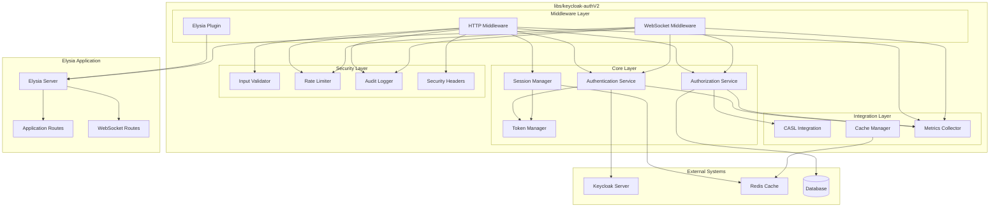
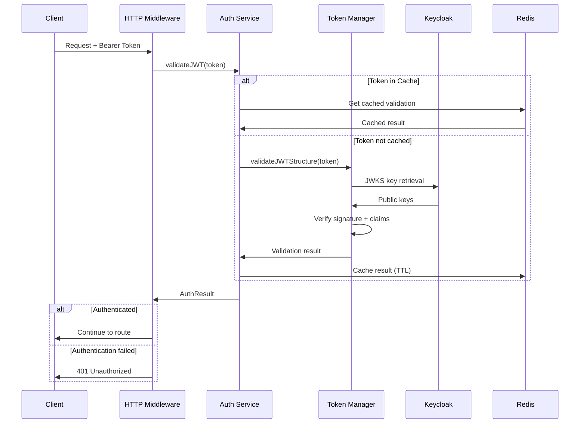
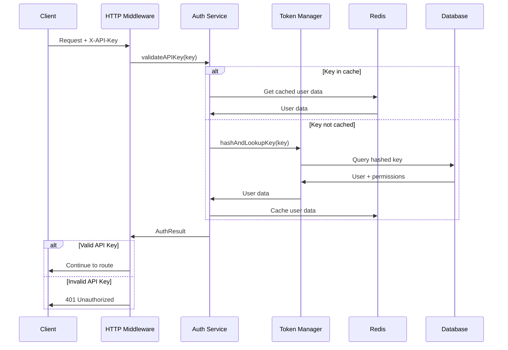
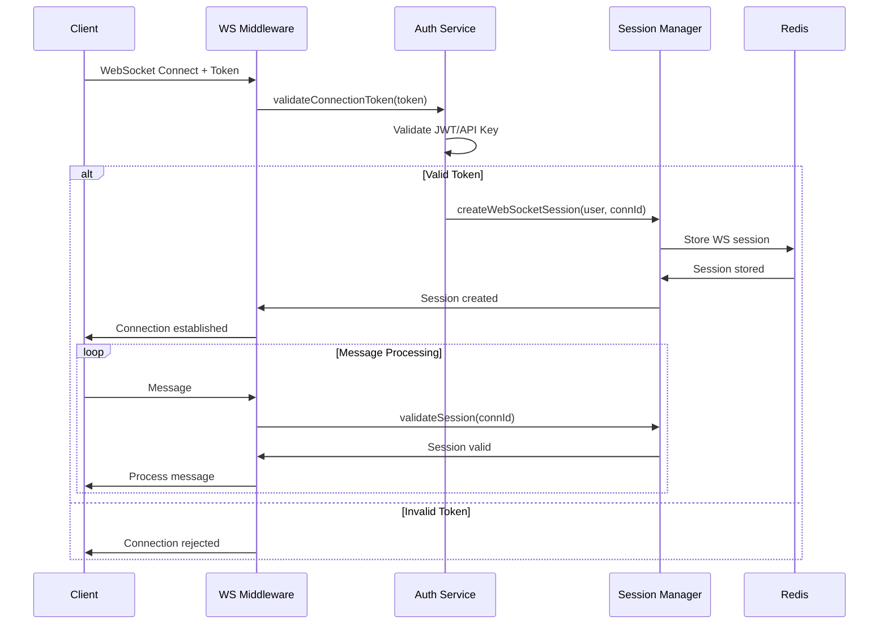

# Keycloak AuthV2 Architecture Design

**Date**: 2025-09-21  
**Version**: 1.0  
**Status**: Draft - Architecture Phase

## Overview

This document defines the secure, production-ready architecture for `libs/keycloak-authV2` that will replace the vulnerable existing `libs/keycloak-auth` library. The design prioritizes security, maintainability, and seamless integration with the existing Elysia + Bun microservices architecture.

## Design Principles

### 1. Security-First Architecture

- **Zero-Trust Model**: Validate every request regardless of source
- **Defense in Depth**: Multiple security layers with proper fallbacks
- **Fail Secure**: All failures result in access denial, never bypass
- **Least Privilege**: Grant minimum necessary permissions
- **Comprehensive Auditing**: Log all security-relevant events

### 2. Clean Architecture Patterns

- **Separation of Concerns**: Clear boundaries between authentication, authorization, and session management
- **Single Responsibility**: Each component has one well-defined purpose
- **Dependency Injection**: Loose coupling through interfaces
- **Battle-Tested Libraries**: Use proven solutions over custom implementations
- **Testable Design**: Architecture that enables comprehensive testing

### 3. Production-Ready Standards

- **Performance**: <50ms authentication overhead target
- **Scalability**: Support for thousands of concurrent users
- **Observability**: Comprehensive metrics, logging, and tracing
- **Reliability**: 99.9% uptime with graceful degradation
- **Maintainability**: Clear documentation and migration paths

## High-Level Architecture



## Core Components

### 1. Authentication Service

**Responsibility**: Handle user identity verification using multiple methods

**Features**:

- JWT token validation with JWKS integration
- API key authentication with secure storage/validation
- Login+password flow via Keycloak OAuth 2.1
- Token introspection for opaque tokens
- Secure token caching with TTL management

**Key Libraries**:

- `jose`: JWT cryptographic operations (replaces `jsonwebtoken` for security)
- `bcrypt`: API key hashing
- `crypto`: Secure random generation

**Interface**:

```typescript
interface AuthenticationService {
  validateJWT(token: string): Promise<AuthResult>;
  validateAPIKey(key: string): Promise<AuthResult>;
  authenticatePassword(credentials: LoginCredentials): Promise<AuthResult>;
  refreshToken(refreshToken: string): Promise<TokenPair>;
  revokeToken(token: string): Promise<void>;
}
```

### 2. Authorization Service (CASL Integration)

**Responsibility**: Handle permission and role-based access control

**Choice: CASL vs Permify Analysis**:

| Aspect                     | CASL                                   | Permify                                 |
| -------------------------- | -------------------------------------- | --------------------------------------- |
| **TypeScript Support**     | ✅ Excellent native TS support         | ❌ gRPC client, limited TS integration  |
| **Integration Complexity** | ✅ Simple library integration          | ❌ Requires separate service deployment |
| **Performance**            | ✅ In-process, <1ms checks             | ❌ Network overhead, ~5-20ms            |
| **Maintainability**        | ✅ Standard npm dependency             | ❌ Additional infrastructure component  |
| **Feature Richness**       | ✅ RBAC, ABAC, field-level permissions | ✅ Advanced relationship-based auth     |
| **Learning Curve**         | ✅ Standard JS patterns                | ❌ Custom DSL and concepts              |
| **Production Maturity**    | ✅ Mature, battle-tested               | ⚠️ Newer, less proven in production     |

**Decision**: **CASL** wins for this implementation due to:

- Superior TypeScript integration
- Zero infrastructure overhead
- Better performance characteristics
- Simpler integration with existing patterns
- Battle-tested in production environments

**CASL Integration Design**:

```typescript
// Custom ability types for our domain
type Actions = "create" | "read" | "update" | "delete" | "manage";
type Subjects = "User" | "Article" | "Comment" | "Organization" | "all";
export type AppAbility = MongoAbility<[Actions, Subjects]>;

interface AuthorizationService {
  checkPermission(
    user: User,
    action: Actions,
    subject: Subjects | object
  ): Promise<boolean>;
  defineAbilitiesFor(user: User): Promise<AppAbility>;
  filterAccessibleRecords<T>(
    user: User,
    records: T[],
    action: Actions
  ): Promise<T[]>;
  getAccessibleFields(user: User, subject: Subjects): Promise<string[]>;
}
```

### 3. Session Manager

**Responsibility**: Secure session lifecycle management

**Features**:

- Redis-based session storage
- Session rotation and invalidation
- Concurrent session limits
- Session hijacking detection
- WebSocket session synchronization

**Interface**:

```typescript
interface SessionManager {
  createSession(user: User, metadata: SessionMetadata): Promise<Session>;
  validateSession(sessionId: string): Promise<Session | null>;
  refreshSession(sessionId: string): Promise<Session>;
  invalidateSession(sessionId: string): Promise<void>;
  invalidateAllUserSessions(userId: string): Promise<void>;
  getActiveSessions(userId: string): Promise<Session[]>;
}
```

### 4. Token Manager

**Responsibility**: JWT and API key lifecycle management

**Features**:

- Secure JWT generation and validation
- API key generation with proper entropy
- Token blacklisting and revocation
- Token refresh with rotation
- Rate limiting per token

**Security Enhancements**:

- Constant-time comparisons for all tokens
- Secure random generation (crypto.randomBytes)
- Token binding to prevent replay attacks
- Configurable token TTL with minimum security thresholds

## Authentication Flows

### 1. JWT Authentication Flow



### 2. API Key Authentication Flow



### 3. WebSocket Authentication Flow



## Security Architecture

### 1. Input Validation & Sanitization

**Strategy**: Defense against injection attacks and malformed data

**Implementation**:

- Zod schemas for all inputs (following @libs/elysia-server patterns)
- HTML sanitization for user-generated content
- SQL injection prevention through parameterized queries
- Path traversal protection for file operations
- Rate limiting on validation failures

### 2. Rate Limiting Strategy

**Multi-Tier Approach**:

1. **Global Rate Limiting**: Prevent DoS attacks

   - 1000 requests/minute per IP
   - 10000 requests/minute globally

2. **Authentication Rate Limiting**: Prevent brute force

   - 5 failed login attempts per IP per 15 minutes
   - 20 failed attempts per user per hour
   - Progressive delays after failures

3. **API Rate Limiting**: Prevent API abuse

   - 100 requests/minute per API key
   - 1000 requests/minute per authenticated user

4. **WebSocket Rate Limiting**: Prevent message flooding
   - 60 messages/minute per connection
   - 10 connections per user

**Integration with @libs/ratelimit**:

```typescript
interface RateLimitIntegration {
  checkAuthenticationRateLimit(
    ip: string,
    userId?: string
  ): Promise<RateLimitResult>;
  checkAPIKeyRateLimit(apiKey: string): Promise<RateLimitResult>;
  checkWebSocketRateLimit(connectionId: string): Promise<RateLimitResult>;
  recordFailedAttempt(ip: string, userId?: string): Promise<void>;
}
```

### 3. Security Headers Management

**Headers Applied**:

- `Strict-Transport-Security`: Force HTTPS
- `Content-Security-Policy`: Prevent XSS attacks
- `X-Frame-Options`: Prevent clickjacking
- `X-Content-Type-Options`: Prevent MIME confusion
- `Referrer-Policy`: Control referrer information
- `Permissions-Policy`: Control browser features

### 4. Audit Logging

**Security Events Logged**:

- Authentication attempts (success/failure)
- Authorization decisions (allow/deny)
- Session creation/destruction
- Token generation/revocation
- Rate limiting triggers
- Security policy violations
- Suspicious activity detection

**Log Format** (structured JSON):

```typescript
interface SecurityAuditLog {
  timestamp: string;
  level: "INFO" | "WARN" | "ERROR";
  event: string;
  userId?: string;
  sessionId?: string;
  ip: string;
  userAgent?: string;
  resource?: string;
  action?: string;
  result: "SUCCESS" | "FAILURE" | "BLOCKED";
  metadata: Record<string, any>;
}
```

## Performance Architecture

### 1. Caching Strategy

**Three-Tier Caching**:

1. **L1 Cache (In-Memory)**: Hot data, 1-minute TTL

   - Recent JWT validation results
   - Active user sessions
   - JWKS keys

2. **L2 Cache (Redis)**: Persistent data, configurable TTL

   - JWT validation results (5-minute TTL)
   - User role/permission data (15-minute TTL)
   - API key validation results (1-hour TTL)

3. **L3 Cache (Database)**: Long-term storage
   - User profiles and roles
   - API key metadata
   - Audit logs

### 2. Performance Targets

| Operation                 | Target Latency | Notes                    |
| ------------------------- | -------------- | ------------------------ |
| JWT Validation (cached)   | <5ms           | L1 cache hit             |
| JWT Validation (uncached) | <50ms          | JWKS + validation        |
| API Key Validation        | <10ms          | Redis lookup             |
| Permission Check (CASL)   | <1ms           | In-memory evaluation     |
| WebSocket Connection Auth | <100ms         | Connection establishment |
| Session Creation          | <20ms          | Redis write              |

### 3. Monitoring & Metrics

**Key Metrics Tracked**:

- Authentication success/failure rates
- Authorization decision latency
- Cache hit/miss ratios
- Rate limiting effectiveness
- WebSocket connection metrics
- Security event frequencies

**Integration with @libs/monitoring**:

```typescript
interface AuthMetrics {
  recordAuthenticationAttempt(
    method: string,
    success: boolean,
    duration: number
  ): void;
  recordAuthorizationCheck(
    resource: string,
    allowed: boolean,
    duration: number
  ): void;
  recordCacheHit(cacheType: string, hit: boolean): void;
  recordRateLimitTrigger(limitType: string, identifier: string): void;
  recordSecurityEvent(event: string, severity: string): void;
}
```

## Technology Stack

### Core Dependencies

| Library          | Version | Purpose              | Justification                                              |
| ---------------- | ------- | -------------------- | ---------------------------------------------------------- |
| `jose`           | ^5.1.3  | JWT operations       | More secure than `jsonwebtoken`, better TypeScript support |
| `@casl/ability`  | ^6.5.0  | Authorization        | Battle-tested, excellent TypeScript integration            |
| `@casl/mongoose` | ^8.0.2  | Database integration | If using Mongoose (optional)                               |
| `bcrypt`         | ^5.1.0  | Password/key hashing | Industry standard for password hashing                     |
| `zod`            | ^3.22.4 | Input validation     | Type-safe validation, integrates with Elysia               |
| `ioredis`        | ^5.3.2  | Redis client         | High-performance Redis client                              |

### Integration Dependencies

| Library               | Version      | Purpose                |
| --------------------- | ------------ | ---------------------- |
| `@libs/database`      | workspace:\* | Redis/DB access        |
| `@libs/monitoring`    | workspace:\* | Metrics & logging      |
| `@libs/elysia-server` | workspace:\* | Middleware integration |
| `@libs/ratelimit`     | workspace:\* | Rate limiting          |
| `@libs/utils`         | workspace:\* | Common utilities       |

### Development Dependencies

| Library                 | Version | Purpose             |
| ----------------------- | ------- | ------------------- |
| `@types/bcrypt`         | ^5.0.0  | TypeScript types    |
| `jest`                  | ^29.7.0 | Testing framework   |
| `supertest`             | ^6.3.3  | HTTP testing        |
| `@testcontainers/redis` | ^10.2.1 | Integration testing |

## Integration Patterns

### 1. Elysia Middleware Integration

**Plugin Pattern**:

```typescript
import { keycloakAuth } from "@libs/keycloak-authv2";

const app = new Elysia()
  .use(
    keycloakAuth({
      keycloak: {
        serverUrl: "https://keycloak.example.com",
        realm: "myapp",
        clientId: "myapp-client",
      },
      authentication: ["jwt", "apikey"],
      authorization: {
        enabled: true,
        defaultPolicy: "deny",
      },
      session: {
        enabled: true,
        store: "redis",
      },
    })
  )
  .get("/protected", ({ user }) => {
    // user is automatically injected by middleware
    return { message: `Hello ${user.name}` };
  });
```

### 2. Authorization Guards

**Decorator Pattern**:

```typescript
import {
  requireAuth,
  requireRole,
  requirePermission,
} from "@libs/keycloak-authv2";

const app = new Elysia()
  .use(keycloakAuth())
  .get("/admin", requireRole("admin"), ({ user }) => {
    return { message: "Admin access granted" };
  })
  .post(
    "/articles",
    requirePermission("create", "Article"),
    ({ user, body }) => {
      // Create article logic
    }
  );
```

### 3. WebSocket Integration

**WebSocket Plugin**:

```typescript
import { keycloakWebSocket } from "@libs/keycloak-authv2";

const app = new Elysia()
  .use(
    keycloakWebSocket({
      connectionAuth: true,
      messageAuth: {
        enabled: true,
        sensitiveActions: ["publish", "delete"],
      },
    })
  )
  .ws("/chat", {
    message(ws, message) {
      // User is available in ws.data.user
      // Authorization is automatically checked for sensitive actions
    },
  });
```

## Migration Strategy

### 1. Gradual Migration Approach

**Phase 1**: New services use `keycloak-authV2`

- All new microservices integrate with the new library
- Existing services continue using old library
- Parallel operation with monitoring

**Phase 2**: Critical services migration

- High-traffic services (api-gateway, ai-engine)
- Comprehensive testing in staging environment
- Gradual rollout with feature flags

**Phase 3**: Complete migration

- Remaining services migrated
- Old library deprecated and removed
- Documentation and training completed

### 2. Backward Compatibility

**Configuration Compatibility**:

- Environment variables remain the same where possible
- Existing middleware patterns supported
- Gradual deprecation of old APIs

**Context Compatibility**:

- User object structure maintained
- Authentication result format preserved
- Error response format consistency

## Risk Mitigation

### 1. Security Risks

| Risk                 | Impact | Probability | Mitigation                                                             |
| -------------------- | ------ | ----------- | ---------------------------------------------------------------------- |
| JWT vulnerabilities  | High   | Low         | Use `jose` library, comprehensive validation, regular security updates |
| Session hijacking    | High   | Medium      | Secure session management, rotation, IP binding                        |
| Rate limiting bypass | Medium | Medium      | Multiple rate limiting layers, behavioral analysis                     |
| Cache poisoning      | Medium | Low         | Cache isolation, input validation, TTL limits                          |

### 2. Performance Risks

| Risk                   | Impact | Probability | Mitigation                                                  |
| ---------------------- | ------ | ----------- | ----------------------------------------------------------- |
| Authentication latency | High   | Medium      | Aggressive caching, performance monitoring, optimization    |
| Redis dependency       | High   | Low         | Redis clustering, failover mechanisms, graceful degradation |
| Memory usage growth    | Medium | Medium      | Memory monitoring, cache size limits, garbage collection    |

### 3. Integration Risks

| Risk                  | Impact | Probability | Mitigation                                                     |
| --------------------- | ------ | ----------- | -------------------------------------------------------------- |
| Breaking changes      | High   | Medium      | Comprehensive testing, gradual rollout, backward compatibility |
| Library compatibility | Medium | Low         | Thorough testing, version pinning, peer dependency management  |
| Documentation gaps    | Medium | Medium      | Comprehensive documentation, code examples, migration guides   |

## Success Metrics

### 1. Security Metrics

- Zero security vulnerabilities in static analysis
- <0.1% authentication bypass rate
- 100% of security events properly logged
- <24 hours security incident response time

### 2. Performance Metrics

- <50ms P95 authentication latency
- > 95% cache hit rate for frequent operations
- <100ms WebSocket connection establishment
- <1% authentication timeout rate

### 3. Reliability Metrics

- 99.9% authentication service uptime
- <0.01% data corruption rate
- 100% backward compatibility maintained
- <30 seconds failover time

### 4. Developer Experience Metrics

- <4 hours integration time for new services
- 95%+ developer satisfaction in surveys
- <2 support tickets per week for auth issues
- 100% API documentation coverage

---

**Next Phase**: Begin implementation starting with core authentication service and CASL integration, followed by Elysia middleware development.
