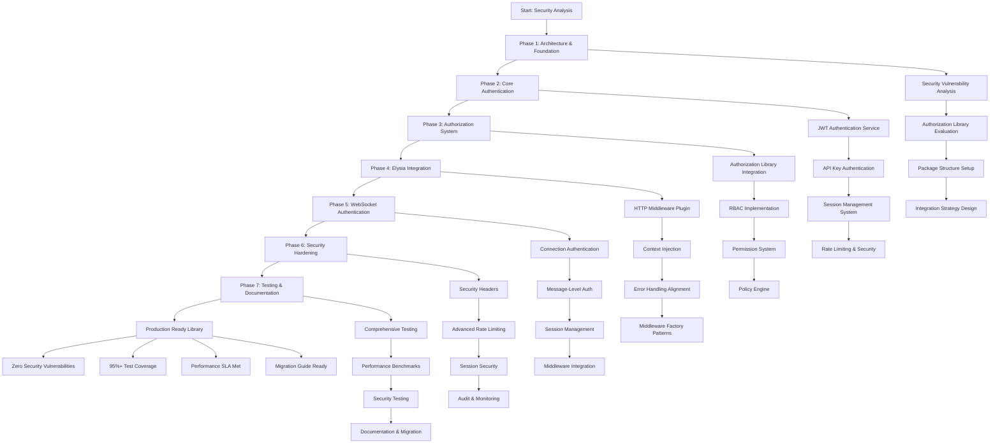
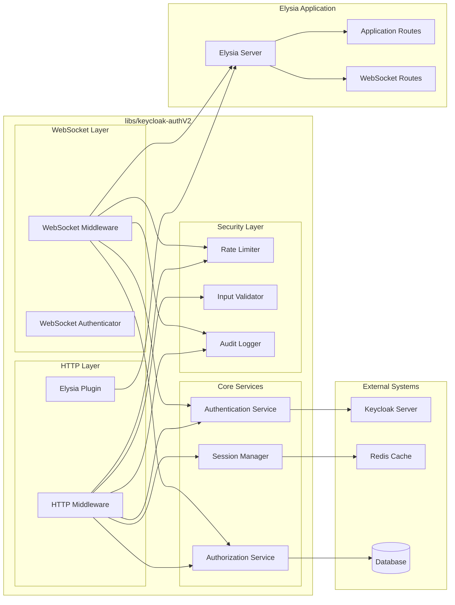
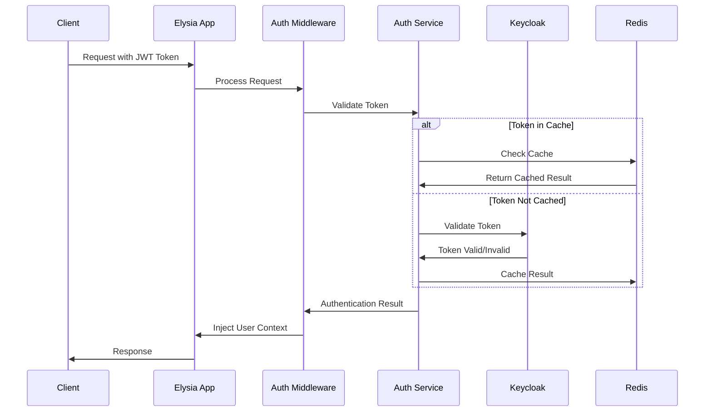
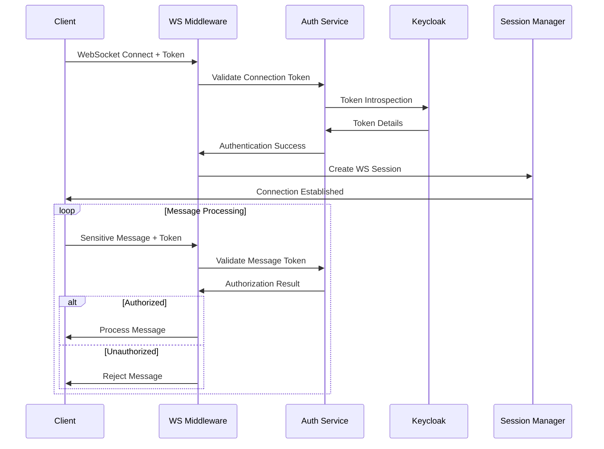
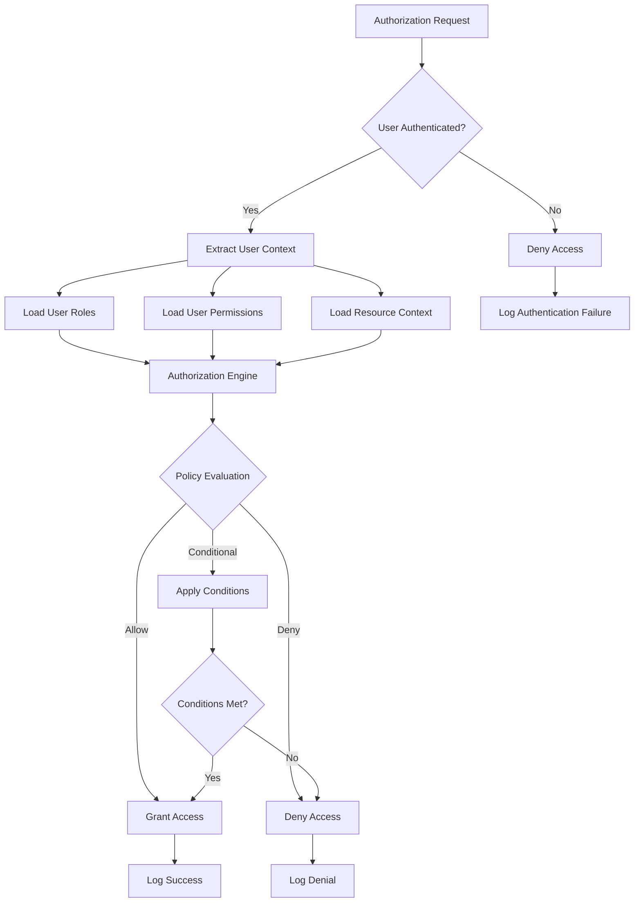
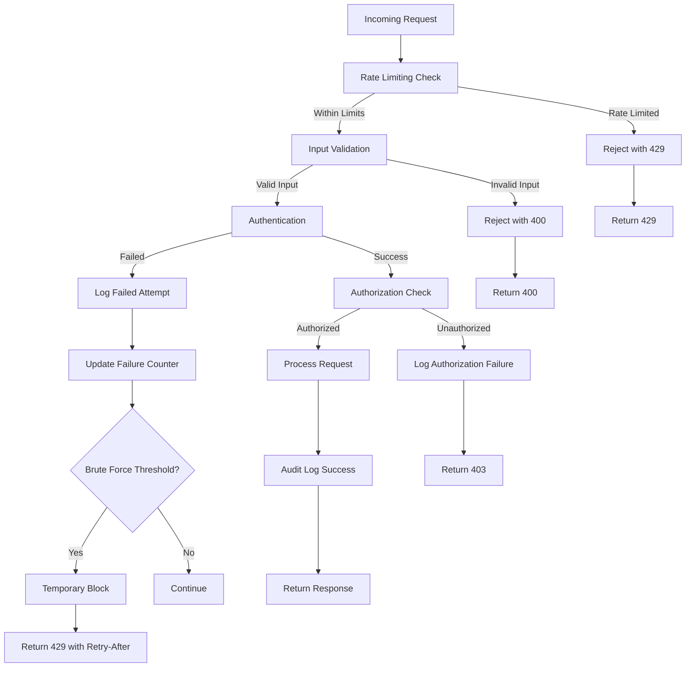
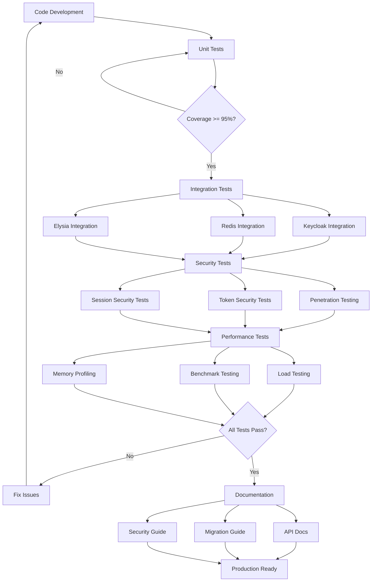
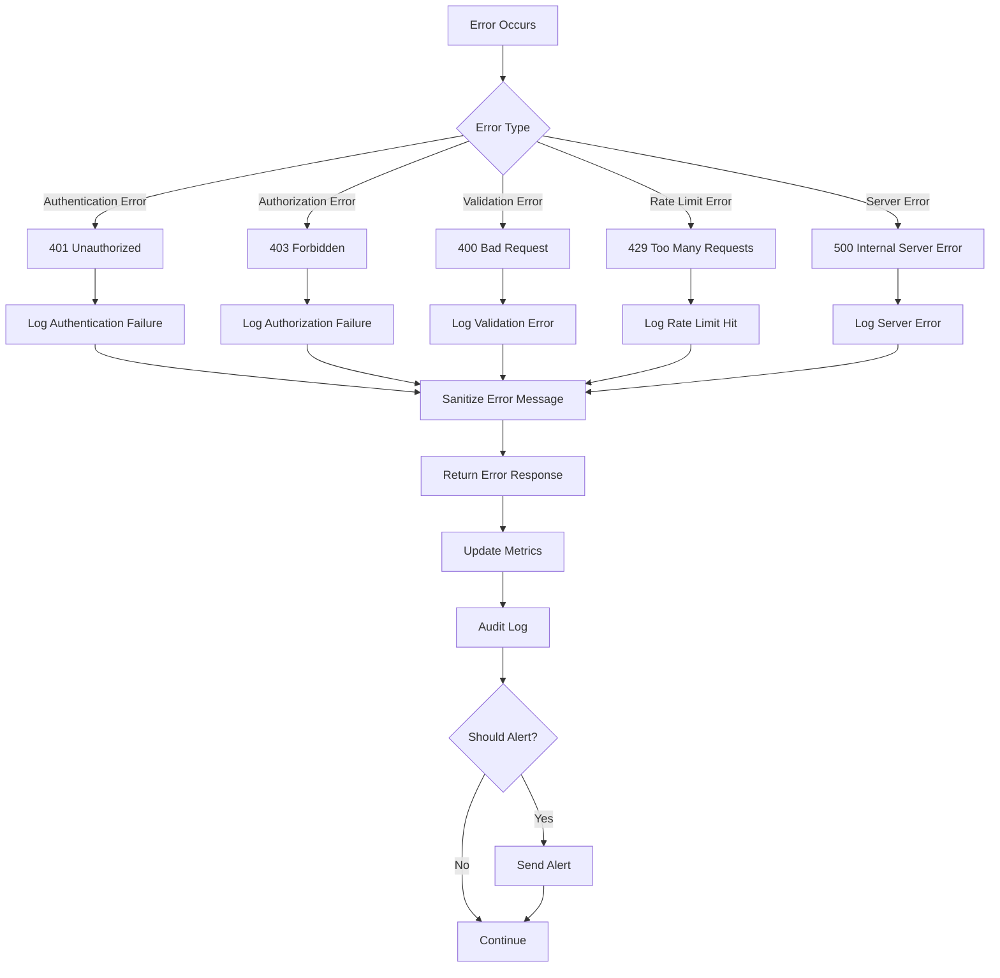

# Keycloak Authentication Library V2 - Workflow Diagram

## High-Level Implementation Flow

## Architecture Overview

## Authentication Flow Diagram

## WebSocket Authentication Flow

## Authorization Decision Flow

## Security Implementation Flow

## Testing Strategy Flow

## Error Handling Flow

---

**Implementation Notes:**

- All flows emphasize security-first approach
- Caching strategies optimize performance without compromising security
- Comprehensive logging and monitoring at every decision point
- Error handling prevents information disclosure
- Testing strategy ensures production readiness
