# Better-Auth Implementation - Workflow Diagram

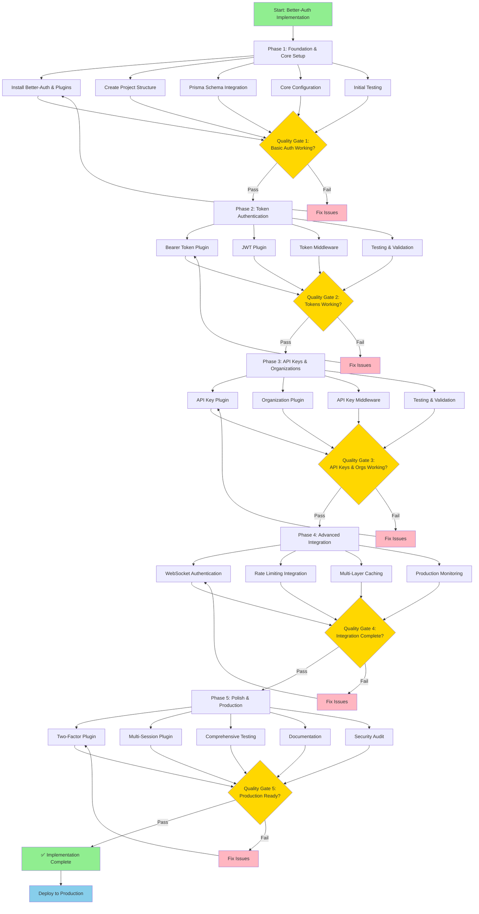

---

## Detailed Phase Breakdown

### Phase 1: Foundation & Core Setup (Day 1)

```mermaid
gantt
    title Phase 1 Timeline
    dateFormat HH:mm
    axisFormat %H:%M

    section Setup
    Install Dependencies           :a1, 00:00, 1h
    Create Structure               :a2, after a1, 1h

    section Database
    Prisma Integration             :a3, after a2, 2h

    section Core
    Configuration Builder          :a4, after a3, 2h

    section Testing
    Initial Tests                  :a5, after a4, 2h
```

**Output**: Email/password authentication working with session management

---

### Phase 2: Token Authentication (Day 2)

```mermaid
gantt
    title Phase 2 Timeline
    dateFormat HH:mm
    axisFormat %H:%M

    section Bearer
    Bearer Plugin                  :b1, 00:00, 2h

    section JWT
    JWT Plugin                     :b2, after b1, 2h

    section Middleware
    Token Middleware               :b3, after b2, 2h

    section Testing
    Token Tests                    :b4, after b3, 2h
```

**Output**: Bearer and JWT authentication working with middleware

---

### Phase 3: API Keys & Organizations (Day 3)

```mermaid
gantt
    title Phase 3 Timeline
    dateFormat HH:mm
    axisFormat %H:%M

    section API Keys
    API Key Plugin                 :c1, 00:00, 3h

    section Organizations
    Organization Plugin            :c2, after c1, 2h

    section Middleware
    API Key Middleware             :c3, after c2, 1h

    section Testing
    Integration Tests              :c4, after c3, 2h
```

**Output**: API keys and multi-tenancy working with RBAC

---

### Phase 4: Advanced Integration (Day 4)

```mermaid
gantt
    title Phase 4 Timeline
    dateFormat HH:mm
    axisFormat %H:%M

    section WebSocket
    WS Authentication              :d1, 00:00, 3h

    section Rate Limiting
    Rate Limit Integration         :d2, after d1, 2h

    section Caching
    Cache Optimization             :d3, after d2, 2h

    section Monitoring
    Production Monitoring          :d4, after d3, 1h
```

**Output**: WebSocket auth, rate limiting, caching, and monitoring integrated

---

### Phase 5: Polish & Production (Day 5)

```mermaid
gantt
    title Phase 5 Timeline
    dateFormat HH:mm
    axisFormat %H:%M

    section Plugins
    Two-Factor Plugin              :e1, 00:00, 2h
    Multi-Session Plugin           :e2, after e1, 1h

    section Testing
    Comprehensive Testing          :e3, after e2, 2h

    section Documentation
    Documentation                  :e4, after e3, 2h

    section Security
    Security Audit                 :e5, after e4, 1h
```

**Output**: Production-ready library with all features and documentation

---

## Authentication Flow Diagrams

### Email/Password Authentication

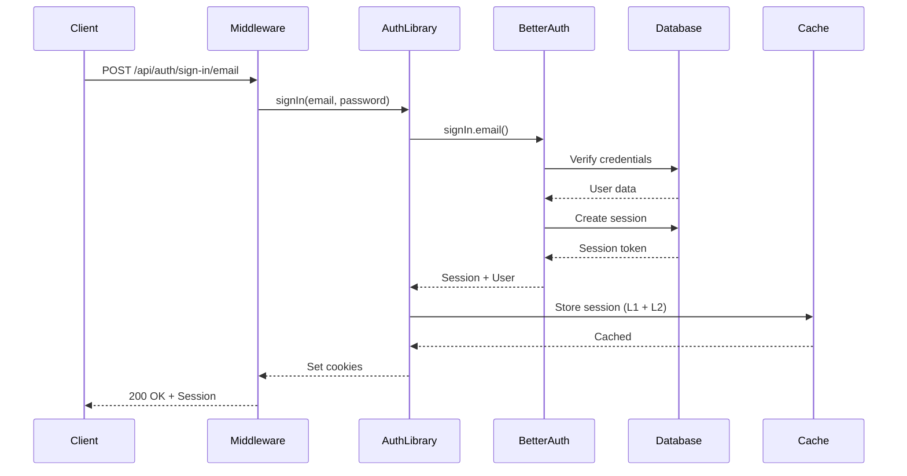

### Bearer Token Authentication

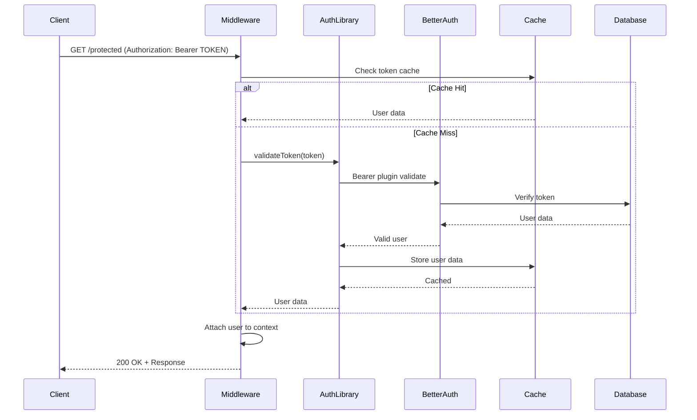

### JWT Authentication

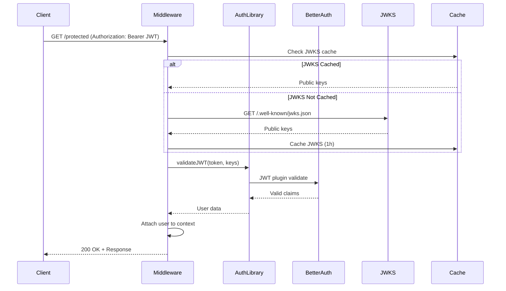

### API Key Authentication

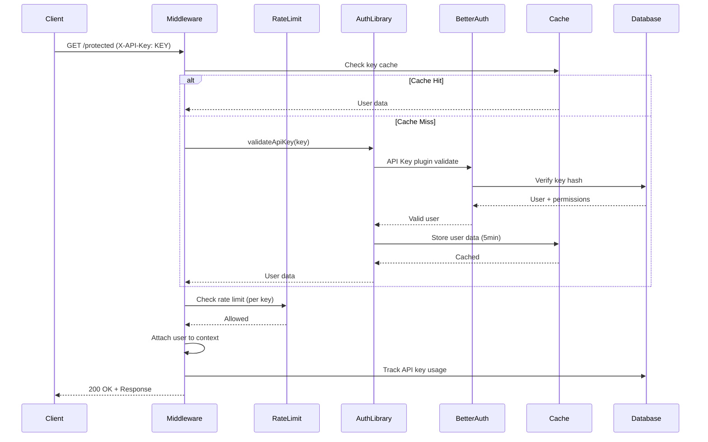

---

## Quality Gates

### Gate 1: Basic Authentication ✅

- [ ] Email/password registration working
- [ ] Login flow functional
- [ ] Sessions created and stored
- [ ] Basic tests passing (>80% coverage)
- [ ] Database integration verified

### Gate 2: Token Authentication ✅

- [ ] Bearer tokens generated and validated
- [ ] JWT tokens generated with JWKS
- [ ] Middleware integrated with Elysia
- [ ] Performance targets met (<30ms JWT P95)
- [ ] Tests passing (>85% coverage)

### Gate 3: API Keys & Organizations ✅

- [ ] API keys created and validated
- [ ] Organizations functional with RBAC
- [ ] Rate limiting per key working
- [ ] Invitation system working
- [ ] Tests passing (>90% coverage)

### Gate 4: Advanced Integration ✅

- [ ] WebSocket authentication working
- [ ] Rate limiting integrated (@libs/ratelimit)
- [ ] Caching optimized (>85% hit rate)
- [ ] Monitoring comprehensive
- [ ] Performance optimized

### Gate 5: Production Ready ✅

- [ ] All plugins integrated
- [ ] Security audit passed
- [ ] Documentation complete
- [ ] Test coverage >90%
- [ ] Performance benchmarks met
- [ ] Zero critical vulnerabilities

---

## Risk Mitigation Strategy

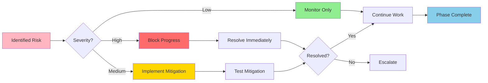

**Risk Categories:**

1. **Technical**: Performance, compatibility, integration issues
2. **Security**: Vulnerabilities, authentication bypass, data exposure
3. **Operational**: Deployment, monitoring, maintenance concerns
4. **Timeline**: Delays, scope creep, resource constraints

**Mitigation Approaches:**

- **Prevention**: Thorough planning, clear requirements, quality gates
- **Detection**: Comprehensive testing, monitoring, code review
- **Response**: Rapid issue resolution, rollback plans, escalation paths
- **Recovery**: Backup systems, graceful degradation, incident response

---

## Success Metrics Dashboard

```
┌─────────────────────────────────────────────────────────────────┐
│ Better-Auth Implementation - Success Metrics                    │
├─────────────────────────────────────────────────────────────────┤
│                                                                 │
│ Overall Progress: [░░░░░░░░░░░░░░░░░░░░░░░░░░] 0%            │
│                                                                 │
│ Phase Breakdown:                                                │
│   Phase 1: Foundation        [░░░░░░░░░░░░░░░░░░░░░░] 0%      │
│   Phase 2: Tokens            [░░░░░░░░░░░░░░░░░░░░░░] 0%      │
│   Phase 3: API Keys & Orgs   [░░░░░░░░░░░░░░░░░░░░░░] 0%      │
│   Phase 4: Integration       [░░░░░░░░░░░░░░░░░░░░░░] 0%      │
│   Phase 5: Polish            [░░░░░░░░░░░░░░░░░░░░░░] 0%      │
│                                                                 │
│ Quality Metrics:                                                │
│   Test Coverage:             0% (Target: >90%)                 │
│   Tests Passing:             0/0                               │
│   Code Quality:              N/A                               │
│   Security Score:            N/A                               │
│                                                                 │
│ Performance Metrics:                                            │
│   Session Validation P95:    N/A (Target: <50ms)              │
│   JWT Validation P95:        N/A (Target: <30ms)              │
│   API Key Validation P95:    N/A (Target: <100ms)             │
│   Cache Hit Rate:            N/A (Target: >85%)               │
│                                                                 │
│ Time Tracking:                                                  │
│   Estimated:                 40h                               │
│   Actual:                    0h                                │
│   Remaining:                 40h                               │
│   On Schedule:               ✅ Yes                            │
│                                                                 │
└─────────────────────────────────────────────────────────────────┘
```

---

## Next Steps

1. **Review this workflow diagram** - Understand the complete flow
2. **Start Phase 1** - Install Better-Auth and dependencies
3. **Follow quality gates** - Don't proceed without passing criteria
4. **Monitor metrics** - Track progress and performance continuously
5. **Update progress.json** - Keep real-time progress tracking updated
