# 🔐 Security Assessment: `@libs/auth` - Critical Weaknesses & Remediation Plan

## Executive Summary

After conducting a comprehensive security review of the `@libs/auth` library, **multiple critical security vulnerabilities and architectural weaknesses** have been identified. While the library demonstrates sophisticated design patterns and comprehensive feature coverage, it contains **severe security flaws** that could lead to authentication bypasses, privilege escalation, and data breaches.

**Risk Level**: 🔴 **CRITICAL**

---

## 🚨 Critical Security Vulnerabilities

### 1. **Password Authentication Bypass (CRITICAL)**

**File**: `keycloak-service.ts:135-155`

```typescript
// CRITICAL VULNERABILITY: Password parameter ignored
async authenticateUserEnhanced(
  email: string,
  _password: string, // 🚨 PASSWORD COMPLETELY IGNORED!
  options?: {...}
): Promise<AuthResult> {
  // ... code gets user from Keycloak without password verification
  const users = await this.client.users.find({
    email,
    enabled: true,
    emailVerified: true,
  });

  // 🚨 AUTHENTICATION SUCCEEDS WITHOUT PASSWORD CHECK!
  return { success: true, user };
}
```

**Impact**: Complete authentication bypass - any user can login with just an email address
**CVSS Score**: 9.8/10 (Critical)

**Immediate Fix**:

```typescript
async authenticateUserEnhanced(email: string, password: string): Promise<AuthResult> {
  // Use Keycloak's direct grant flow for password authentication
  try {
    const tokenResponse = await this.client.auth({
      username: email,
      password: password,
      grantType: "password",
      clientId: this.config.keycloak.clientId,
      clientSecret: this.config.keycloak.clientSecret,
    });

    if (!tokenResponse.access_token) {
      return { success: false, error: "Invalid credentials" };
    }

    // Continue with user retrieval...
  } catch (error) {
    return { success: false, error: "Authentication failed" };
  }
}
```

### 2. **JWT Token Replay Attack (HIGH)**

**File**: `jwt-service.ts:168-180`

```typescript
// VULNERABILITY: Weak token revocation check
private async isTokenRevoked(token: string): Promise<boolean> {
  try {
    const hash = this.hashToken(token);
    const result = await this.deps.redis.get(`revoked:${hash}`);
    return result === "1";
  } catch (error) {
    // 🚨 FAILS OPEN - returns false on Redis error!
    return false;
  }
}
```

**Impact**: Revoked tokens accepted when Redis is unavailable
**Fix**: Fail secure by returning `true` on Redis errors

### 3. **Privilege Escalation via Permission Cache (HIGH)**

**File**: `auth-service.ts:545-575`

```typescript
// VULNERABILITY: Cache poisoning possible
private async enrichUserWithPermissions(user: User): Promise<User> {
  if (this.permissionCache) {
    const cachedPermissions = await this.permissionCache.getUserPermissions(user.id);
    if (cachedPermissions) {
      // 🚨 No validation of cached permissions!
      return { ...user, permissions: cachedPermissions };
    }
  }
  // ...
}
```

**Impact**: Cached permissions never validated against current user roles
**Fix**: Add cache integrity validation and TTL enforcement

### 4. **Admin Credentials Hardcoded in Environment (MEDIUM)**

**File**: `keycloak-service.ts:38-48`

```typescript
// SECURITY ISSUE: Admin credentials in environment
const adminUsername = getEnv("KEYCLOAK_ADMIN_USERNAME");
const adminPassword = getEnv("KEYCLOAK_ADMIN_PASSWORD");
```

**Impact**: Admin credentials exposed in environment variables
**Fix**: Use service accounts with scoped permissions instead

---

## 🏗️ Architectural Security Flaws

### 1. **Inconsistent Error Handling**

**Pattern Throughout Codebase**:

```typescript
// ❌ Information disclosure
catch (error) {
  return { success: false, error: error.message, code: "SPECIFIC_ERROR" };
}

// ✅ Secure pattern
catch (error) {
  this.logger.error("Operation failed", { error, userId });
  return { success: false, error: "Authentication failed", code: "AUTH_FAILED" };
}
```

**Issues**:

- Detailed error messages leak system information
- Stack traces exposed in responses
- Different error codes reveal system internals

### 2. **Rate Limiting Configuration for Authentication Endpoints**

**Status**: ✅ **PROPERLY IMPLEMENTED** - Advanced rate limiting middleware available

The system includes comprehensive rate limiting via `@libs/elysia-server/RateLimitHttpMiddleware`:

- Multiple algorithms: sliding-window, fixed-window, token-bucket, leaky-bucket
- Key strategies: IP, user, API key, custom
- Enterprise-grade cache adapter with Redis backend
- Built-in metrics and monitoring

**Configuration Recommendation**:

```typescript
// Apply strict rate limiting to authentication endpoints
const authRateLimit = RateLimitHttpMiddleware.createStrictConfig();
authRateLimit.maxRequests = 5; // Only 5 login attempts
authRateLimit.windowMs = 900000; // 15 minute window
authRateLimit.keyStrategy = "ip"; // Per IP address
authRateLimit.skipPaths = ["/health", "/metrics"]; // Skip monitoring endpoints
```

**Authentication-Specific Rate Limiting**:

- Login endpoints: 5 attempts per 15 minutes per IP
- Registration: 3 attempts per hour per IP
- Password reset: 2 attempts per hour per email
- Token refresh: 10 attempts per minute per user

### 3. **Insecure Session Management**

**File**: `session-service.ts:45-65`

```typescript
// VULNERABILITY: Sessions not properly invalidated
async revokeSession(sessionId: string): Promise<boolean> {
  try {
    await this.deps.redis.del(`session:${sessionId}`);
    return true;
  } catch (error) {
    // 🚨 Session deletion failure not handled properly
    return false;
  }
}
```

**Issues**:

- No cleanup of related session data
- No notification to other services
- Concurrent session limits not enforced

### 4. **Weak JWT Configuration**

**File**: `jwt-service.ts:28-45`

```typescript
// SECURITY WEAKNESS: Short refresh token expiry pattern
const refreshTokenExpiry =
  now + this.parseTimeToSeconds(this.config.jwt.refreshExpiresIn);

// But no automatic cleanup of old refresh tokens
// No refresh token rotation
// No family-based token tracking
```

---

## 🔧 Service Dependencies Security Issues

### 1. **Dependency Injection Vulnerabilities**

**File**: `types/index.ts:98-105`

```typescript
export interface ServiceDependencies {
  database: any; // 🚨 Untyped - injection attacks possible
  redis: any; // 🚨 Untyped - command injection possible
  monitoring: any; // 🚨 Untyped
  config: AuthConfig;
}
```

**Fix**: Strict typing required:

```typescript
export interface ServiceDependencies {
  database: DatabaseConnection;
  redis: RedisClient;
  monitoring: MonitoringService;
  config: AuthConfig;
}
```

### 2. **Configuration Validation Missing**

**No validation of critical security parameters**:

- JWT secret strength not validated
- Token expiry limits not enforced
- Redis connection security not verified
- Keycloak SSL/TLS requirements not enforced

---

## 📊 Authentication Flow Security Analysis

### Current Login Flow (Vulnerable):

```mermaid
sequenceDiagram
    participant Client
    participant AuthService
    participant KeycloakService
    participant JWT

    Client->>AuthService: login(email, password)
    AuthService->>KeycloakService: authenticateUserEnhanced(email, _password)
    Note over KeycloakService: 🚨 PASSWORD IGNORED
    KeycloakService->>Keycloak: users.find({email})
    Keycloak-->>KeycloakService: user data
    KeycloakService-->>AuthService: {success: true, user}
    AuthService->>JWT: generateTokens(user)
    JWT-->>Client: {accessToken, refreshToken}
```



### Secure Login Flow (Required):


---

## 🛡️ Comprehensive Remediation Plan

### Phase 1: Critical Security Fixes (Immediate - 1-2 days)

1. **Fix Password Authentication Bypass**:

   ```typescript
   // Replace mock authentication with real Keycloak integration
   async authenticateUserEnhanced(email: string, password: string): Promise<AuthResult> {
     return await this.performKeycloakDirectGrant(email, password);
   }
   ```

2. **Secure Token Revocation**:

   ```typescript
   private async isTokenRevoked(token: string): Promise<boolean> {
     try {
       const hash = this.hashToken(token);
       const result = await this.deps.redis.get(`revoked:${hash}`);
       return result === "1";
     } catch (error) {
       // 🛡️ FAIL SECURE - assume revoked when Redis unavailable
       this.deps.monitoring.logger.error("Redis check failed - failing secure", { error });
       return true;
     }
   }
   ```

3. **Configure Authentication-Specific Rate Limiting**:
   ```typescript
   // Apply strict rate limiting to authentication endpoints
   const authRateLimit = {
     ...RateLimitHttpMiddleware.createStrictConfig(),
     maxRequests: 5, // Only 5 login attempts
     windowMs: 900000, // 15 minute window
     keyStrategy: "ip" as const,
     skipPaths: ["/health", "/metrics"],
   };
   ```

### Phase 2: Architecture Security Hardening (1 week)

1. **Implement Secure Error Handling**:

   ```typescript
   class SecureAuthError extends AuthError {
     constructor(
       internalMessage: string,
       publicMessage: string = "Authentication failed"
     ) {
       super(publicMessage, "AUTH_FAILED");
       this.logError(internalMessage);
     }
   }
   ```

2. **Add Comprehensive Input Validation**:

   ```typescript
   const loginSchema = z.object({
     email: z.string().email().max(254),
     password: z.string().min(8).max(128),
     deviceInfo: z.object({...}).optional()
   });
   ```

3. **Implement Session Security**:
   ```typescript
   interface SecureSession extends Session {
     fingerprint: string;
     ipAddress: string;
     csrfToken: string;
     createdAt: Date;
     lastActivity: Date;
     maxConcurrentSessions: number;
   }
   ```

### Phase 3: Advanced Security Features (2 weeks)

1. **Multi-Factor Authentication Support**:

   ```typescript
   interface MFAChallenge {
     type: "totp" | "sms" | "email";
     token: string;
     expiresAt: Date;
   }
   ```

2. **Advanced Threat Detection**:

   ```typescript
   class SecurityAnomalyDetector {
     async detectAnomalousLogin(
       user: User,
       context: LoginContext
     ): Promise<ThreatLevel>;
     async blockSuspiciousActivity(pattern: ActivityPattern): Promise<void>;
   }
   ```

3. **Audit Trail Implementation**:
   ```typescript
   interface SecurityEvent {
     userId?: string;
     action: string;
     timestamp: Date;
     ipAddress: string;
     userAgent: string;
     outcome: "success" | "failure";
     riskScore: number;
   }
   ```

---

## 🔍 Testing Security Requirements

### Critical Security Test Cases:

```typescript
describe("Authentication Security", () => {
  it("should reject login attempts with wrong password", async () => {
    const result = await authService.login({
      email: "user@example.com",
      password: "wrong-password",
    });

    expect(result.success).toBe(false);
    expect(result.error).toBe("Invalid credentials");
  });

  it("should enforce rate limiting on repeated failed attempts", async () => {
    // Simulate 6 failed login attempts
    for (let i = 0; i < 6; i++) {
      await authService.login({ email: "user@example.com", password: "wrong" });
    }

    const result = await authService.login({
      email: "user@example.com",
      password: "correct-password",
    });

    expect(result.success).toBe(false);
    expect(result.code).toBe("RATE_LIMITED");
  });

  it("should reject revoked tokens even with Redis failure", async () => {
    const token = "valid-token";
    await jwtService.revokeToken(token);

    // Simulate Redis failure
    mockRedis.get.mockRejectedValue(new Error("Redis down"));

    const user = await jwtService.verifyToken(token);
    expect(user).toBeNull(); // Should fail secure
  });

  it("should invalidate cache when user permissions change", async () => {
    const userId = "user-123";

    // Cache permissions
    await permissionCache.setUserPermissions(userId, ["read:data"]);

    // Change user role
    await userService.updateUser(userId, { roles: ["admin"] });

    // Cache should be invalidated
    const cachedPerms = await permissionCache.getUserPermissions(userId);
    expect(cachedPerms).toBeNull();
  });
});
```

---

## 📋 Security Checklist

### ✅ Must-Fix Items (Before Production):

- [ ] **Fix password authentication bypass**
- [ ] **Configure rate limiting for authentication endpoints**
- [ ] **Secure error handling**
- [ ] **Validate cached permissions**
- [ ] **Add comprehensive input validation**
- [ ] **Implement secure session management**
- [ ] **Add audit logging for all auth events**
- [ ] **Enforce strong JWT configuration**
- [ ] **Type all service dependencies**
- [ ] **Add security headers to all responses**

### ⚠️ Security Best Practices to Implement:

- [ ] **Principle of Least Privilege**: Users get minimum required permissions
- [ ] **Defense in Depth**: Multiple security layers
- [ ] **Fail Secure**: Systems fail to secure state, not open
- [ ] **Zero Trust**: Verify every request and user
- [ ] **Security by Design**: Security built into architecture
- [ ] **Regular Security Reviews**: Automated and manual testing

---

## 🎯 Recommendations

### Immediate Actions (Priority 1):

1. **STOP using the current authentication flow in production**
2. **Implement proper Keycloak password authentication**
3. **Configure rate limiting middleware for authentication endpoints**
4. **Review and secure all error handling**

### Short-term Improvements (Priority 2):

1. **Comprehensive security testing suite**
2. **Input validation on all endpoints**
3. **Secure session management**
4. **Audit trail implementation**

### Long-term Security Roadmap (Priority 3):

1. **Multi-factor authentication support**
2. **Advanced threat detection**
3. **Security compliance frameworks (SOC2, ISO27001)**
4. **Regular penetration testing**

---

## 📞 Next Steps

1. **Security Team Review**: Schedule immediate security review meeting
2. **Production Impact Assessment**: Evaluate current production exposure
3. **Emergency Patch Planning**: Plan immediate fixes for critical vulnerabilities
4. **Security Testing**: Implement comprehensive security test suite
5. **Third-party Security Audit**: Consider external security assessment

**This library should not be used in production until critical vulnerabilities are addressed.**

---

_This assessment was conducted on September 16, 2025. Security landscapes evolve rapidly - regular reassessment is recommended._
