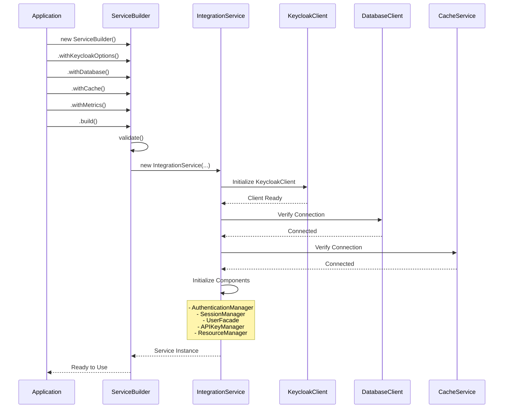
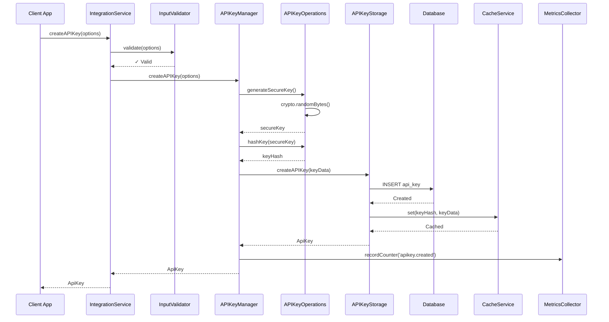
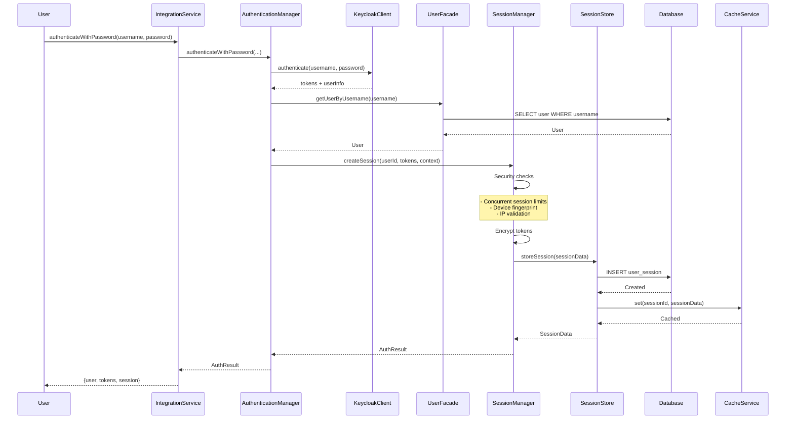
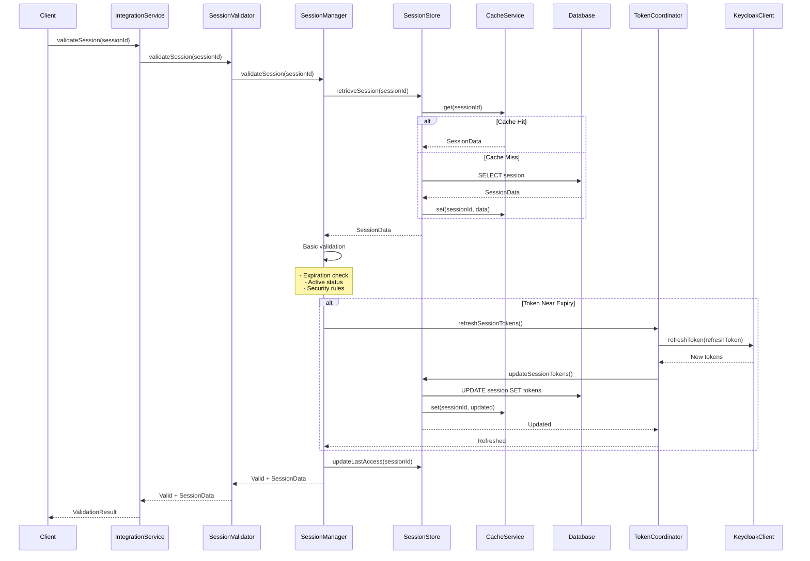
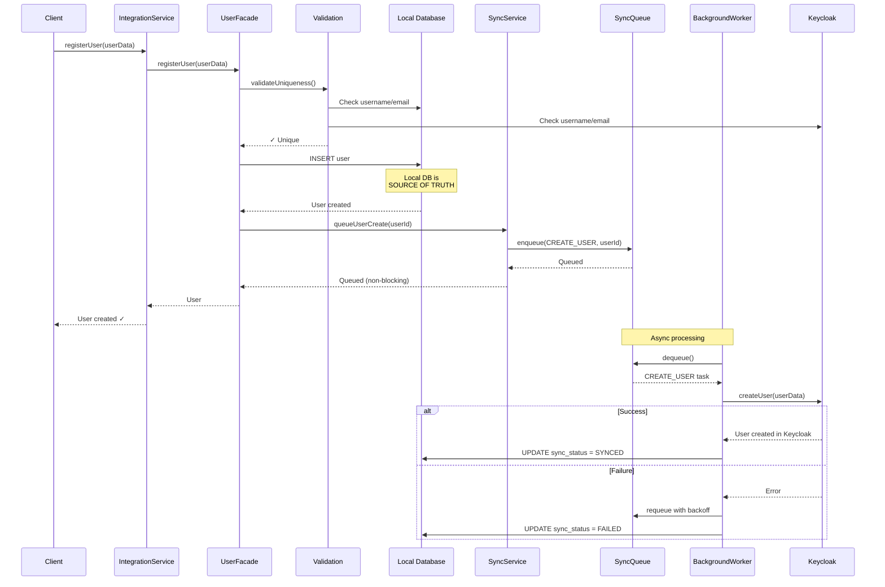
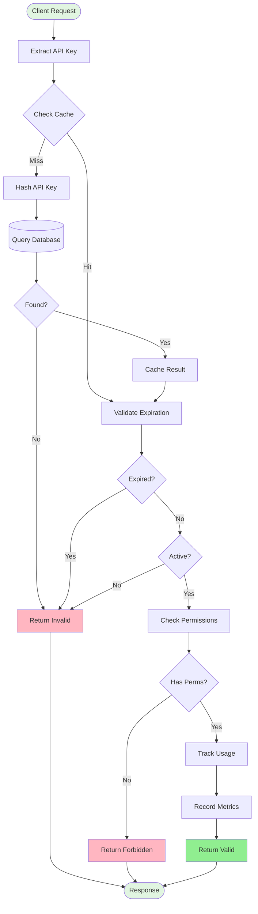
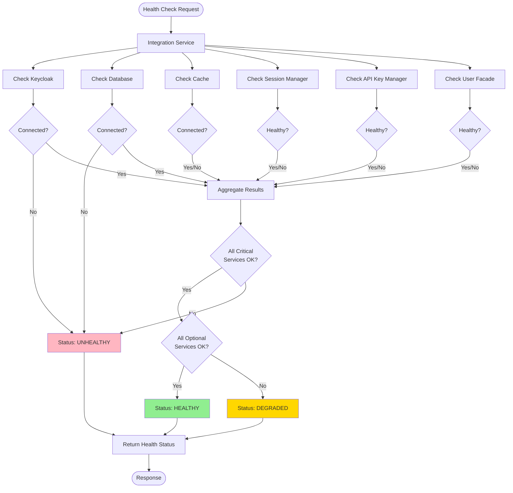
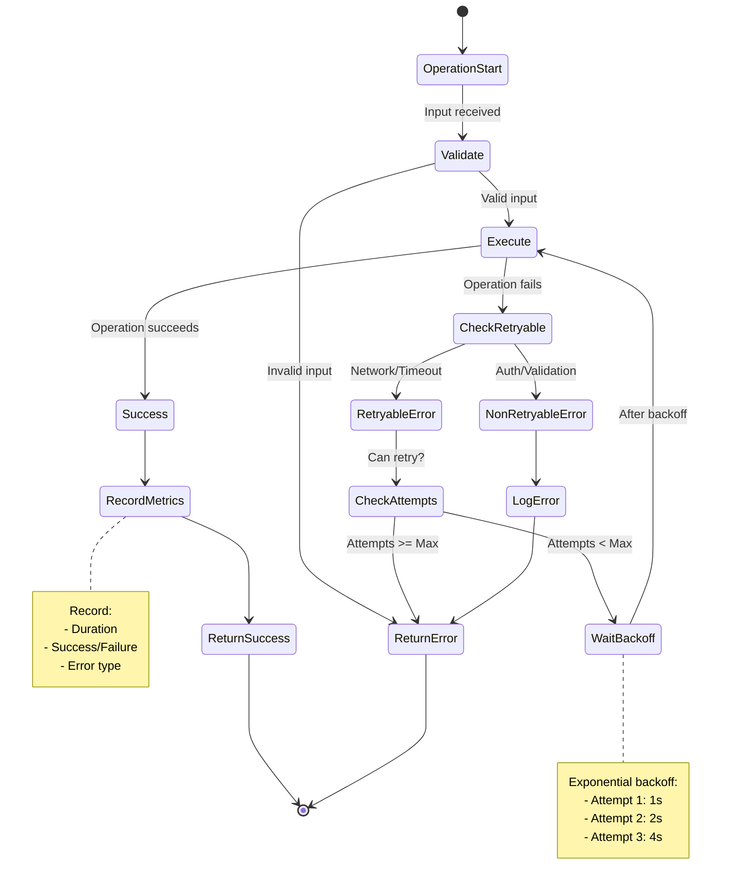
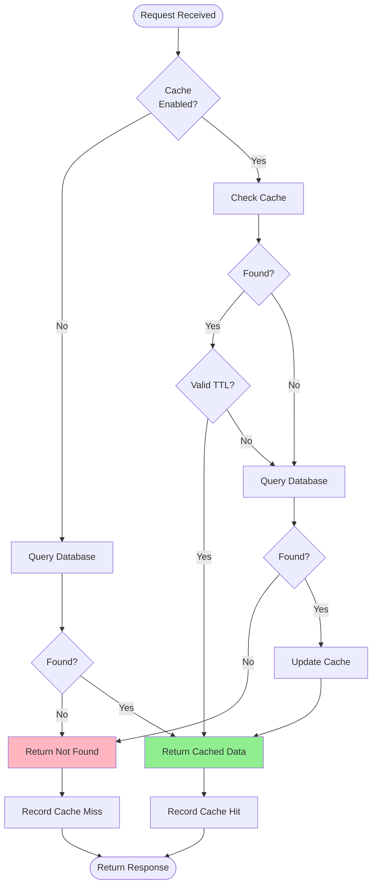
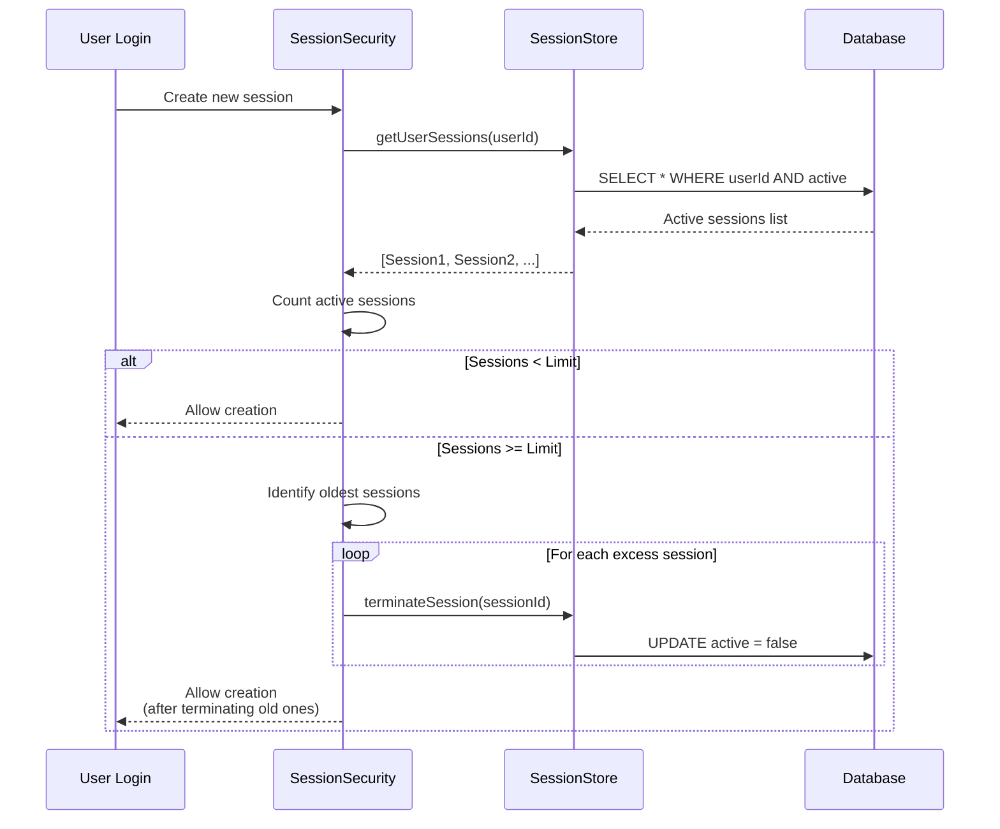

# KeycloakIntegrationService - Implementation Flows

**Visual Guides and Sequence Diagrams**

---

## 🔄 Flow Diagrams

### 1. Service Initialization Flow



---

### 2. API Key Creation Flow



---

### 3. Authentication & Session Creation Flow



---

### 4. Session Validation with Token Refresh



---

### 5. User Registration with Async Keycloak Sync



---

### 6. API Key Validation Flow (Cached)



---

### 7. Complete Health Check Flow



---

### 8. Error Handling & Retry Flow



---

### 9. Cache Strategy Decision Tree



---

### 10. Concurrent Session Limit Enforcement



---

## 🎯 Implementation Decision Matrix

### When to Use Each Component

| Scenario                     | Component to Use                           | Reason                  |
| ---------------------------- | ------------------------------------------ | ----------------------- |
| User login with password     | `AuthenticationManager` → `SessionManager` | Full auth flow          |
| API request authentication   | `APIKeyManager.validateAPIKey()`           | API key validation      |
| Check if session still valid | `SessionValidator.validateSession()`       | Session validation      |
| Create new user account      | `UserFacade.registerUser()`                | Complete registration   |
| Update user profile          | `UserFacade.updateUser()`                  | User management         |
| Change password              | `UserFacade.updatePassword()`              | Keycloak-only operation |
| Assign roles                 | `UserFacade.assignRealmRoles()`            | Role management         |
| Admin session termination    | `SessionManager.destroySession()`          | Admin operation         |
| Token expired, need refresh  | `SessionManager.refreshSessionTokens()`    | Token refresh           |
| Check system health          | `ResourceManager.checkHealth()`            | Monitoring              |

---

## 🚀 Quick Start Implementation Guide

### Scenario 1: Add API Key Support to Existing Service

**Current Code (Before)**:

```typescript
const integrationService = KeycloakIntegrationService.create(
  keycloakOptions,
  dbClient,
  metrics
);

// API keys not available!
```

**Updated Code (After)**:

```typescript
const integrationService = createIntegrationServiceBuilder()
  .withKeycloakOptions(keycloakOptions)
  .withDatabase(dbClient)
  .withCache(cacheService) // ← Add cache for better performance
  .withMetrics(metrics)
  .build();

await integrationService.initialize();

// Now API keys work!
const apiKey = await integrationService.createAPIKey({
  userId: "user-123",
  name: "Production API Key",
  scopes: ["read", "write"],
  permissions: ["users:read", "users:write"],
});

console.log(`API Key: ${apiKey.keyPreview}`);
```

---

### Scenario 2: Implement Complete User Registration

**Implementation**:

```typescript
import { createIntegrationServiceBuilder } from "@libs/keycloak-authV2";

// Build service with all features
const service = createIntegrationServiceBuilder()
  .withKeycloakOptions(keycloakOptions)
  .withDatabase(dbClient)
  .withCache(cacheService)
  .withMetrics(metrics)
  .withSyncService(syncService) // ← Enable async Keycloak sync
  .build();

// Register user
const user = await service.registerUser({
  username: "newuser",
  email: "user@example.com",
  password: "SecurePass123!",
  firstName: "John",
  lastName: "Doe",
  storeId: "store-123",
  roleId: "role-user",
});

// User is immediately available in local DB
console.log(`User created: ${user.id}`);

// Keycloak sync happens asynchronously in background
// Check sync status
const syncStatus = await service.getUserSyncStatus(user.id);
console.log(`Sync status: ${syncStatus.status}`);
```

---

### Scenario 3: Implement Session Management with Auto-Refresh

**Implementation**:

```typescript
const service = createIntegrationServiceBuilder()
  .withKeycloakOptions(keycloakOptions)
  .withDatabase(dbClient)
  .withCache(cacheService)
  .withMetrics(metrics)
  .build();

// Authenticate user
const authResult = await service.authenticateWithPassword(
  "username",
  "password",
  {
    ipAddress: req.ip,
    userAgent: req.headers["user-agent"],
  }
);

if (authResult.success) {
  const sessionId = authResult.session!.sessionId;

  // Store session ID in cookie/header
  res.cookie("sessionId", sessionId, { httpOnly: true });

  // On subsequent requests
  const validation = await service.validateSession(sessionId, {
    ipAddress: req.ip,
    userAgent: req.headers["user-agent"],
  });

  if (validation.valid) {
    // Token automatically refreshed if near expiry
    if (validation.refreshed) {
      console.log("Token was automatically refreshed");
    }

    // Access user data
    const user = validation.session?.userInfo;
    console.log(`Authenticated as: ${user?.username}`);
  }
}
```

---

### Scenario 4: Implement Comprehensive Health Monitoring

**Implementation**:

```typescript
const service = createIntegrationServiceBuilder()
  .withKeycloakOptions(keycloakOptions)
  .withDatabase(dbClient)
  .withCache(cacheService)
  .withMetrics(metrics)
  .withSyncService(syncService)
  .build();

// Health check endpoint
app.get("/health", async (req, res) => {
  const health = await service.checkHealth();

  const statusCode =
    health.status === "healthy"
      ? 200
      : health.status === "degraded"
      ? 200
      : 503;

  res.status(statusCode).json({
    status: health.status,
    timestamp: health.details.timestamp,
    components: {
      keycloak: health.details.components.keycloakClient,
      database: health.details.components.database,
      cache: health.details.components.cache,
      sessions: health.details.components.sessionManager,
      apiKeys: health.details.components.apiKeyManager,
      userSync: health.details.components.userSync,
    },
    uptime: process.uptime(),
  });
});

// Detailed statistics endpoint
app.get("/stats", async (req, res) => {
  const stats = await service.getStats();

  res.json({
    sessions: stats.session,
    apiKeys: stats.apiKey,
    client: stats.client,
    tokens: stats.token,
  });
});
```

---

## 🔍 Debugging Guide

### Common Issues & Solutions

#### Issue 1: Cache Not Working

**Symptom**: Performance slower than expected, high DB load

**Diagnosis**:

```typescript
const health = await service.checkHealth();
console.log("Cache enabled:", health.details.components.cache?.enabled);
```

**Solution**:

```typescript
// Ensure cache service is provided
const service = createIntegrationServiceBuilder()
  .withCache(cacheService) // ← Don't forget this!
  .build();
```

---

#### Issue 2: User Sync Failing

**Symptom**: Users created in local DB but not in Keycloak

**Diagnosis**:

```typescript
const syncHealth = await service.getSyncHealthStatus();
console.log("Sync status:", syncHealth.overall);
console.log("Failed operations:", syncHealth.queue.metrics.failed);
```

**Solution**:

```typescript
// Retry failed operations
const retried = await service.retrySyncOperations(10);
console.log(`Retried ${retried} operations`);

// Or check individual user
const userSyncStatus = await service.getUserSyncStatus(userId);
if (userSyncStatus.status === "FAILED") {
  console.log("Sync failed for user:", userId);
}
```

---

#### Issue 3: Session Validation Failing

**Symptom**: Users getting logged out unexpectedly

**Diagnosis**:

```typescript
const validation = await service.validateSession(sessionId, context);
if (!validation.valid) {
  console.log("Validation failed:", validation.reason);
}
```

**Common Reasons**:

- Session expired: Token TTL passed
- Fingerprint mismatch: User changed browser/device
- Concurrent limit: Too many active sessions
- Security violation: Suspicious activity detected

---

## 📊 Performance Optimization Tips

### 1. Enable Caching

```typescript
const service = createIntegrationServiceBuilder()
  .withCache(cacheService) // 70%+ performance improvement
  .build();
```

### 2. Use API Keys for Service-to-Service

```typescript
// Instead of OAuth for every request
const apiKey = await service.createAPIKey({
  userId: "service-account",
  scopes: ["read", "write"],
});

// Validation is much faster (cached)
const validation = await service.validateAPIKey(apiKey.keyPreview);
```

### 3. Batch Operations

```typescript
// Instead of individual user lookups
const users = await service.searchUsers({
  storeId: "store-123",
  take: 100,
});
```

### 4. Monitor and Tune

```typescript
const stats = await service.getStats();
console.log(
  "Cache hit rate:",
  stats.token.cacheHits / (stats.token.cacheHits + stats.token.cacheMisses)
);
```

---

**Document Version**: 1.0.0  
**Last Updated**: October 7, 2025  
**Status**: ✅ Ready for Use
